# 🔬 VoiceZettel 2.0 — Полный Архитектурный Аудит

> **Дата аудита:** 15 апреля 2026  
> **Охват:** 100% кодовой базы — 37 API routes, 10 компонентных групп, 9 Zustand stores, 10 hooks, 30+ lib-модулей, 5 Python-микросервисов

---

## 📋 Оглавление

1. [Архитектурный обзор](#1-архитектурный-обзор)
2. [Frontend: Компоненты и UI](#2-frontend-компоненты-и-ui)
3. [State Management: Zustand Stores](#3-state-management-zustand-stores)
4. [Hooks: Бизнес-логика](#4-hooks-бизнес-логика)
5. [Lib: Низкоуровневые модули](#5-lib-низкоуровневые-модули)
6. [API Routes: Серверные эндпоинты](#6-api-routes-серверные-эндпоинты)
7. [Python-микросервисы](#7-python-микросервисы)
8. [Матрица готовности функций](#8-матрица-готовности-функций)
9. [Скрытый код (написан, но не в UI)](#9-скрытый-код-написан-но-не-в-ui)
10. [Недостающие API-ключи и конфигурация](#10-недостающие-api-ключи-и-конфигурация)
11. [Эволюция идей: что изменилось, от чего отказались](#11-эволюция-идей)
12. [Критические проблемы и рекомендации](#12-критические-проблемы-и-рекомендации)
13. [Приоритизированный план доработки](#13-приоритизированный-план-доработки)

---

## 1. Архитектурный обзор

```mermaid
graph TB
    subgraph "🌐 Frontend (Next.js 16 + React 19)"
        UI[Main UI Page] --> OrbArea[OrbArea<br/>3 режима: Voice/Lavalier/Agent]
        UI --> ChatArea[ChatArea<br/>Текстовый чат]
        UI --> TopCountersBar[TopCountersBar<br/>Счётчики: ideas/facts/tasks/persons]
        UI --> SettingsPanel[SettingsPanel<br/>12 секций настроек]
        UI --> NotificationBell[NotificationBell<br/>Уведомления]
        AdminUI[Admin Dashboard] --> DashboardTab[DashboardTab<br/>14 health-нод]
        AdminUI --> TelegramTab[TelegramTab<br/>Экспорт + Live Sync]
        AdminUI --> MissionControlTab[MissionControlTab<br/>SSE логи + Entity Ribbon]
        AdminUI --> WorkspaceTab[WorkspaceTab<br/>Google Docs sync]
        AdminUI --> LogsTab[LogsTab<br/>Логи системы]
        AdminUI --> UsersTab[UsersTab<br/>Управление пользователями]
        AdminUI --> PromptsTab[PromptsTab<br/>Промпты]
    end

    subgraph "⚡ API Routes (Next.js Serverless)"
        ChatAPI["/api/chat"] --> Providers[LLM Providers<br/>OpenAI/DeepSeek/Gemini]
        VoiceAPI["/api/tts, tts-local, tts-piper, tts-qwen, tts-yandex"] --> TTS[5 TTS провайдеров]
        HealthAPI["/api/health, voice-health, local-health"] --> Services
        TelegramAPI["/api/telegram/*"] --> TgService
        AutoHealAPI["/api/auto-heal"] --> AllServices[Все сервисы]
        WorkspaceAPI["/api/workspace/sync"] --> ChromaDB
        CRMAPI["/api/crm"] --> SQLite
    end

    subgraph "🐍 Python Microservices"
        TgService[Telegram Service<br/>:8038] --> Telethon[MTProto + Whisper]
        IndexerService[Indexer Service<br/>:8030] --> ChromaDB[(ChromaDB)]
        OpenClawService[OpenClaw Daemon<br/>:8040] --> WikiPipeline[Raw_v2 → Wiki_v2]
        MemoryService[Memory Module] --> SQLite[(SQLite)]
    end

    subgraph "🗄 Storage"
        ChromaDB
        SQLite
        ObsidianVault[Obsidian Vault<br/>Local REST API :27123]
        IndexedDB[IndexedDB<br/>PWA Offline]
    end

    OrbArea -- "WebSocket" --> LocalCore[Local Core<br/>faster-whisper GPU :8000]
    OrbArea -- "WebSocket" --> GeminiLive[Gemini Live API]
    OrbArea -- "WebRTC" --> OpenAIRT[OpenAI Realtime API]
```

### Технологический стек

| Слой | Технология | Версия |
|------|-----------|--------|
| **Frontend** | Next.js (App Router) | 16 |
| **UI** | React + Framer Motion | 19 |
| **3D** | Three.js (ParticleOrb, ParticleHead) | latest |
| **State** | Zustand + persist + subscribeWithSelector | 5.x |
| **Styling** | Tailwind CSS + custom CSS | 3.x |
| **Backend** | Next.js API Routes + FastAPI | — |
| **LLM** | OpenAI / DeepSeek / Google Gemini | gpt-4o-mini / deepseek-chat / gemini-2.5-flash |
| **Voice STT** | faster-whisper (local GPU) / Yandex / Browser | — |
| **Voice TTS** | Edge TTS / Silero / Piper / Qwen / Yandex | — |
| **Speech-to-Speech** | Gemini Multimodal Live / OpenAI Realtime | WebSocket / WebRTC |
| **Vector DB** | ChromaDB | — |
| **Structured DB** | SQLite (via better-sqlite3) | — |
| **Integrations** | Obsidian REST API / Telegram MTProto | — |
| **CI/CD** | GitHub Actions | — |
| **Testing** | Vitest | 99 tests |

---

## 2. Frontend: Компоненты и UI

### 2.1 Компоненты Orb (src/components/orb/)

| Файл | Размер | Назначение |
|------|--------|-----------|
| [OrbArea.tsx](file:///C:/Users/anton/OneDrive/Документы/VoiceZettel/src/components/orb/OrbArea.tsx) | 8.5KB | **Контейнер 3 режимов** (Voice/Lavalier/Agent). Swipe-навигация между режимами. Tap-to-start/stop/interrupt. |
| [ParticleOrb.tsx](file:///C:/Users/anton/OneDrive/Документы/VoiceZettel/src/components/orb/ParticleOrb.tsx) | 14.7KB | **3D WebGL Orb** — Three.js частицы с семантической окраской (idle=violet, listening=cyan, thinking=amber, speaking=emerald). Реагирует на audioLevel. |
| [ParticleHead.tsx](file:///C:/Users/anton/OneDrive/Документы/VoiceZettel/src/components/orb/ParticleHead.tsx) | 18.1KB | **3D голова из частиц** — продвинутая визуализация для premium-режима. |
| [LavalierOrb.tsx](file:///C:/Users/anton/OneDrive/Документы/VoiceZettel/src/components/orb/LavalierOrb.tsx) | 6.3KB | **Режим петлички** — фоновая запись встреч. Кнопки Start/Pause/Stop + индикатор записи. |
| [AgentOrb.tsx](file:///C:/Users/anton/OneDrive/Документы/VoiceZettel/src/components/orb/AgentOrb.tsx) | 0.8KB | **Режим агента** — заглушка/placeholder для автономного агента OpenClaw. |
| [MeetingSummary.tsx](file:///C:/Users/anton/OneDrive/Документы/VoiceZettel/src/components/orb/MeetingSummary.tsx) | 10.4KB | **Модалка сводки встречи** — отображает AI-сгенерированный summary после завершения записи. |
| [NebulaOrb.tsx](file:///C:/Users/anton/OneDrive/Документы/VoiceZettel/src/components/orb/NebulaOrb.tsx) | 2.0KB | **CSS-only Nebula Orb** — fallback для устройств без WebGL. |
| [AiOrb.tsx](file:///C:/Users/anton/OneDrive/Документы/VoiceZettel/src/components/orb/AiOrb.tsx) | 4.1KB | **2D animated Orb** — простой CSS-анимированный орб. |

### 2.2 Admin Dashboard (src/components/admin/)

| Файл | Размер | Назначение |
|------|--------|-----------|
| [DashboardTab.tsx](file:///C:/Users/anton/OneDrive/Документы/VoiceZettel/src/components/admin/DashboardTab.tsx) | **84.5KB** | **Нервный центр** — 14 health-нод с auto-polling. Каждый узел: status, restart, logs. Самый большой файл проекта. |
| [TelegramTab.tsx](file:///C:/Users/anton/OneDrive/Документы/VoiceZettel/src/components/admin/TelegramTab.tsx) | **77.8KB** | **Telegram управление** — экспорт чатов с очередью, live-синхронизация, transcription голосовых. |
| [WorkspaceTab.tsx](file:///C:/Users/anton/OneDrive/Документы/VoiceZettel/src/components/admin/WorkspaceTab.tsx) | 16.7KB | **Google Workspace** — sync публичных Google Docs → ChromaDB. |
| [UsersTab.tsx](file:///C:/Users/anton/OneDrive/Документы/VoiceZettel/src/components/admin/UsersTab.tsx) | 12.5KB | **Управление пользователями** — whitelist, роли. |
| [MissionControlTab.tsx](file:///C:/Users/anton/OneDrive/Документы/VoiceZettel/src/components/admin/MissionControlTab.tsx) | 9.6KB | **Mission Control** — SSE real-time логи, heartbeat мониторинг, entity ribbon. |
| [LogsTab.tsx](file:///C:/Users/anton/OneDrive/Документы/VoiceZettel/src/components/admin/LogsTab.tsx) | 9.7KB | **Логи системы** — фильтрация по уровню, поиск. |
| [AdminSidebar.tsx](file:///C:/Users/anton/OneDrive/Документы/VoiceZettel/src/components/admin/AdminSidebar.tsx) | 6.7KB | **Боковая панель** — навигация между табами. |
| [TerminalView.tsx](file:///C:/Users/anton/OneDrive/Документы/VoiceZettel/src/components/admin/TerminalView.tsx) | 5.0KB | **Терминал** — встроенный эмулятор терминала для команд. |
| [TraceVisualizer.tsx](file:///C:/Users/anton/OneDrive/Документы/VoiceZettel/src/components/admin/TraceVisualizer.tsx) | 4.5KB | **Trace визуализация** — трассировка обработки сообщений. |
| [PromptsTab.tsx](file:///C:/Users/anton/OneDrive/Документы/VoiceZettel/src/components/admin/PromptsTab.tsx) | 4.6KB | **Промпты** — редактор системных промптов. |

### 2.3 Settings (src/components/settings/)

| Файл | Назначение |
|------|-----------|
| [SettingsPanel.tsx](file:///C:/Users/anton/OneDrive/Документы/VoiceZettel/src/components/settings/SettingsPanel.tsx) | **Корневая панель** — аккордеон из 12 секций. |
| [AiSection.tsx](file:///C:/Users/anton/OneDrive/Документы/VoiceZettel/src/components/settings/AiSection.tsx) | Выбор AI-провайдера (OpenAI/DeepSeek/Gemini), модели, temperature. |
| [VoiceSection.tsx](file:///C:/Users/anton/OneDrive/Документы/VoiceZettel/src/components/settings/VoiceSection.tsx) | Выбор voice mode (Local/Browser/Yandex/Gemini Live), TTS-провайдера. |
| [ObsidianSection.tsx](file:///C:/Users/anton/OneDrive/Документы/VoiceZettel/src/components/settings/ObsidianSection.tsx) | Настройки подключения Obsidian (URL, API key). |
| [WidgetsSection.tsx](file:///C:/Users/anton/OneDrive/Документы/VoiceZettel/src/components/settings/WidgetsSection.tsx) | Кастомные виджеты-счётчики + visual/sound effects. |
| [PromptsSection.tsx](file:///C:/Users/anton/OneDrive/Документы/VoiceZettel/src/components/settings/PromptsSection.tsx) | Редактор системного и Zettelkasten промптов. |
| [AgentsSection.tsx](file:///C:/Users/anton/OneDrive/Документы/VoiceZettel/src/components/settings/AgentsSection.tsx) | Настройки агентов (OpenClaw/Shelestun). |
| [LogsSection.tsx](file:///C:/Users/anton/OneDrive/Документы/VoiceZettel/src/components/settings/LogsSection.tsx) | Просмотр логов в настройках. |
| [NotesSection.tsx](file:///C:/Users/anton/OneDrive/Документы/VoiceZettel/src/components/settings/NotesSection.tsx) | Настройки заметок. |
| [AddWidgetScreen.tsx](file:///C:/Users/anton/OneDrive/Документы/VoiceZettel/src/components/settings/AddWidgetScreen.tsx) | Экран создания кастомного виджета. |
| [IconPicker.tsx](file:///C:/Users/anton/OneDrive/Документы/VoiceZettel/src/components/settings/IconPicker.tsx) | Выбор иконки для виджета. |

### 2.4 Counter Animations (src/components/counters/)

| Файл | Назначение |
|------|-----------|
| [TopCountersBar.tsx](file:///C:/Users/anton/OneDrive/Документы/VoiceZettel/src/components/counters/TopCountersBar.tsx) | Верхняя панель с 4 встроенными + N кастомными счётчиками. |
| [VisualEffects.tsx](file:///C:/Users/anton/OneDrive/Документы/VoiceZettel/src/components/counters/VisualEffects.tsx) | **17.2KB** — 10 визуальных эффектов (sparkle_burst, confetti, ripple, etc.). |
| [FlyingIcon.tsx](file:///C:/Users/anton/OneDrive/Документы/VoiceZettel/src/components/counters/FlyingIcon.tsx) | Анимация летящей иконки от центра к счётчику. |
| [ParticleBurst.tsx](file:///C:/Users/anton/OneDrive/Документы/VoiceZettel/src/components/counters/ParticleBurst.tsx) | Взрыв частиц при increment. |

### 2.5 Layout (src/components/layout/)

| Файл | Назначение |
|------|-----------|
| [DailyOffloadOverlay.tsx](file:///C:/Users/anton/OneDrive/Документы/VoiceZettel/src/components/layout/DailyOffloadOverlay.tsx) | **Daily Offload Dashboard** — утренний дайджест действий (reminders, messages, tasks). |
| [NotificationBell.tsx](file:///C:/Users/anton/OneDrive/Документы/VoiceZettel/src/components/layout/NotificationBell.tsx) | Колокольчик уведомлений с badge. |
| [ChangelogNotifier.tsx](file:///C:/Users/anton/OneDrive/Документы/VoiceZettel/src/components/layout/ChangelogNotifier.tsx) | Уведомление о новых обновлениях. |
| [TopBar.tsx](file:///C:/Users/anton/OneDrive/Документы/VoiceZettel/src/components/layout/TopBar.tsx) | Верхняя навигация. |
| [MainLayout.tsx](file:///C:/Users/anton/OneDrive/Документы/VoiceZettel/src/components/layout/MainLayout.tsx) | Главный layout-wrapper. |

---

## 3. State Management: Zustand Stores

| Store | Размер | Ключевые поля |
|-------|--------|--------------|
| [settingsStore.ts](file:///C:/Users/anton/OneDrive/Документы/VoiceZettel/src/stores/settingsStore.ts) | **16.3KB** | `aiProvider`, `voiceMode`, `ttsProvider`, `edgeTtsVoice`, `localTtsVoice`, `piperTtsVoice`, `obsidianApiKey`, `orbParticles`, `systemPrompt`, `zettelkastenPrompt`, `customWidgets[]`, `syncSources{}`, `widgetEffects[]`, `lavMode`. 15 миграций. |
| [chatStore.ts](file:///C:/Users/anton/OneDrive/Документы/VoiceZettel/src/stores/chatStore.ts) | 4.1KB | `messages[]`, `orbState`, `audioLevel`, `modality`, `liveTranscript`, `orbMode`. |
| [notesStore.ts](file:///C:/Users/anton/OneDrive/Документы/VoiceZettel/src/stores/notesStore.ts) | 9.7KB | Заметки Zettelkasten — CRUD, поиск, категоризация. |
| [countersStore.ts](file:///C:/Users/anton/OneDrive/Документы/VoiceZettel/src/stores/countersStore.ts) | 3.7KB | `ideas`, `facts`, `tasks`, `persons` — встроенные счётчики. |
| [notificationStore.ts](file:///C:/Users/anton/OneDrive/Документы/VoiceZettel/src/stores/notificationStore.ts) | 4.1KB | Уведомления + **OffloadActions** (Daily Offload Dashboard). |
| [animationStore.ts](file:///C:/Users/anton/OneDrive/Документы/VoiceZettel/src/stores/animationStore.ts) | 1.6KB | triggerAnimation() — триггер анимации счётчиков. |
| [lavalierStore.ts](file:///C:/Users/anton/OneDrive/Документы/VoiceZettel/src/stores/lavalierStore.ts) | 2.1KB | Transcript entries, meeting status, timing. |
| [adminStore.ts](file:///C:/Users/anton/OneDrive/Документы/VoiceZettel/src/stores/adminStore.ts) | 1.3KB | activeTab, sidebar state. |
| [rewardStore.ts](file:///C:/Users/anton/OneDrive/Документы/VoiceZettel/src/stores/rewardStore.ts) | 0.7KB | Gamification rewards (minimal). |

---

## 4. Hooks: Бизнес-логика

| Hook | Размер | Назначение |
|------|--------|-----------|
| [useVoiceSession.ts](file:///C:/Users/anton/OneDrive/Документы/VoiceZettel/src/hooks/useVoiceSession.ts) | **39.3KB** | **Ядро voice pipeline**. Flow: Mic → STT → LLM → TTS. Поддержка 4 STT-провайдеров (Local, Browser, Yandex, Gemini Live). Sentence-level TTS streaming. Barge-in детекция. iOS audio unlock. |
| [voiceHelpers.ts](file:///C:/Users/anton/OneDrive/Документы/VoiceZettel/src/hooks/voiceHelpers.ts) | 12.8KB | AsyncQueue, prefetchEdgeTTS/LocalTTS/PiperTTS/QwenTTS, cleanResponseText, speakWithBrowserTTS, getAudioLevel. |
| [useLavalierSession.ts](file:///C:/Users/anton/OneDrive/Документы/VoiceZettel/src/hooks/useLavalierSession.ts) | 10.8KB | **Фоновая запись встречи**. Использует LocalVoiceClient. Автоопределение вопросов к ассистенту по шаблону. askAssistant() — задать вопрос не прерывая запись. |
| [useGeminiLiveSession.ts](file:///C:/Users/anton/OneDrive/Документы/VoiceZettel/src/hooks/useGeminiLiveSession.ts) | 10.5KB | Gemini Live WebSocket session management. Отдельный hook для Speech-to-Speech. |
| [useTextChat.ts](file:///C:/Users/anton/OneDrive/Документы/VoiceZettel/src/hooks/useTextChat.ts) | 10.4KB | Текстовый чат — отправка сообщений с function calling support. |
| [useChatStream.ts](file:///C:/Users/anton/OneDrive/Документы/VoiceZettel/src/hooks/useChatStream.ts) | 8.2KB | SSE streaming parser — разбивка потока на предложения для TTS. |
| [useElevenLabsTTS.ts](file:///C:/Users/anton/OneDrive/Документы/VoiceZettel/src/hooks/useElevenLabsTTS.ts) | 5.3KB | ⚠️ **ЗАБРОШЕН** — ElevenLabs TTS (заменён на Edge/Local/Piper/Qwen). |
| [useSpeechRecognition.ts](file:///C:/Users/anton/OneDrive/Документы/VoiceZettel/src/hooks/useSpeechRecognition.ts) | 3.0KB | Browser Web Speech API — overlay live transcript. |
| [useSettingsSync.ts](file:///C:/Users/anton/OneDrive/Документы/VoiceZettel/src/hooks/useSettingsSync.ts) | 3.2KB | Синхронизация settings с сервером. |
| [useChatSync.ts](file:///C:/Users/anton/OneDrive/Документы/VoiceZettel/src/hooks/useChatSync.ts) | 2.4KB | Синхронизация чата с сервером. |

---

## 5. Lib: Низкоуровневые модули

### 5.1 Voice & STT Clients

| Модуль | Назначение |
|--------|-----------|
| [localVoiceClient.ts](file:///C:/Users/anton/OneDrive/Документы/VoiceZettel/src/lib/localVoiceClient.ts) | WebSocket клиент → Local faster-whisper GPU STT (:8000). PCM16 AudioWorklet → WebSocket → JSON transcripts. |
| [geminiLiveClient.ts](file:///C:/Users/anton/OneDrive/Документы/VoiceZettel/src/lib/geminiLiveClient.ts) | Gemini Multimodal Live WebSocket — полный Speech-to-Speech. Антиэхо (suppresses mic while speaking). Barge-in по RMS. Context injection из Obsidian vault. |
| [realtimeVoiceClient.ts](file:///C:/Users/anton/OneDrive/Документы/VoiceZettel/src/lib/realtimeVoiceClient.ts) | OpenAI Realtime API (WebRTC). SDP negotiation, data channel events, text/audio modalities. VAD config. Context injection. |
| [yandexSttClient.ts](file:///C:/Users/anton/OneDrive/Документы/VoiceZettel/src/lib/yandexSttClient.ts) | Yandex SpeechKit streaming STT. |
| [browserSttClient.ts](file:///C:/Users/anton/OneDrive/Документы/VoiceZettel/src/lib/browserSttClient.ts) | Web Speech API fallback STT. |

### 5.2 AI & Chat

| Модуль | Назначение |
|--------|-----------|
| [chatContext.ts](file:///C:/Users/anton/OneDrive/Документы/VoiceZettel/src/lib/chatContext.ts) | **14.4KB** — Контекст для чата: собирает память, vault заметки, Telegram переписки, preferences. |
| [chatTools.ts](file:///C:/Users/anton/OneDrive/Документы/VoiceZettel/src/lib/chatTools.ts) | Function calling: `save_memory`, `search_memory`, `create_zettel`. OpenAI tool format. |
| [messageClassifier.ts](file:///C:/Users/anton/OneDrive/Документы/VoiceZettel/src/lib/messageClassifier.ts) | Автоклассификация сообщений → idea/fact/task/persona. Создаёт Zettel заметки автоматически. Использует OpenAI > Gemini > DeepSeek. |
| [sseStream.ts](file:///C:/Users/anton/OneDrive/Документы/VoiceZettel/src/lib/sseStream.ts) | SSE streaming + DSML function call execution + counter tag injection. Два режима: voice (zero-latency passthrough) и text (full buffering). |
| [parseDSML.ts](file:///C:/Users/anton/OneDrive/Документы/VoiceZettel/src/lib/parseDSML.ts) | Парсер DSML (Domain Specific Markup Language) — извлечение function calls из текста. |
| [stripDSML.ts](file:///C:/Users/anton/OneDrive/Документы/VoiceZettel/src/lib/stripDSML.ts) | Очистка DSML тегов из ответа. |
| [providers/](file:///C:/Users/anton/OneDrive/Документы/VoiceZettel/src/lib/providers) | Абстракция LLM провайдеров — OpenAI, DeepSeek, Gemini. Base interface для единообразного API. |

### 5.3 Memory & Storage

| Модуль | Назначение |
|--------|-----------|
| [memoryStore.ts](file:///C:/Users/anton/OneDrive/Документы/VoiceZettel/src/lib/memoryStore.ts) | Семантическая память (ChromaDB + SQLite). saveMemory(), searchMemories(). |
| [embeddings.ts](file:///C:/Users/anton/OneDrive/Документы/VoiceZettel/src/lib/embeddings.ts) | Генерация embeddings для семантического поиска. |
| [db.ts](file:///C:/Users/anton/OneDrive/Документы/VoiceZettel/src/lib/db.ts) | SQLite wrapper (better-sqlite3). |

### 5.4 Obsidian Integration

| Модуль | Назначение |
|--------|-----------|
| [obsidianClient.ts](file:///C:/Users/anton/OneDrive/Документы/VoiceZettel/src/lib/obsidianClient.ts) | `sendToObsidian()` — автосохранение диалогов в Obsidian vault через REST API. |
| [vaultWriter.ts](file:///C:/Users/anton/OneDrive/Документы/VoiceZettel/src/lib/vaultWriter.ts) | `writeNoteToVault()` — запись Zettelkasten заметок. Поддержка Obsidian REST API и прямой файловой записи. |
| [vaultContext.ts](file:///C:/Users/anton/OneDrive/Документы/VoiceZettel/src/lib/vaultContext.ts) | Чтение контекста из Obsidian vault для инъекции в LLM промпт. |
| [obsidianVaultReader.ts](file:///C:/Users/anton/OneDrive/Документы/VoiceZettel/src/lib/obsidianVaultReader.ts) | Прямое чтение файлов vault (fallback если REST API недоступен). |

### 5.5 Utilities

| Модуль | Назначение |
|--------|-----------|
| [sounds.ts](file:///C:/Users/anton/OneDrive/Документы/VoiceZettel/src/lib/sounds.ts) | **17KB** — 10 процедурных звуковых эффектов через Web Audio API (crystal_chime, coin_cascade, level_up, zen_bowl, achievement, harp_gliss, magic_wand, cash_register, power_up, celestial). |
| [tokenPricing.ts](file:///C:/Users/anton/OneDrive/Документы/VoiceZettel/src/lib/tokenPricing.ts) | Расчёт стоимости токенов по моделям (USD/RUB). |
| [detectCounterType.ts](file:///C:/Users/anton/OneDrive/Документы/VoiceZettel/src/lib/detectCounterType.ts) | Парсинг `[COUNTER:xxx]` тегов из ответа LLM. |
| [detectPreference.ts](file:///C:/Users/anton/OneDrive/Документы/VoiceZettel/src/lib/detectPreference.ts) | Парсинг `[SAVE_PREF:xxx]` тегов для сохранения предпочтений. |
| [changelog.ts](file:///C:/Users/anton/OneDrive/Документы/VoiceZettel/src/lib/changelog.ts) | Версионирование и журнал изменений. |
| [logger.ts](file:///C:/Users/anton/OneDrive/Документы/VoiceZettel/src/lib/logger.ts) | Логирование (console + remote). |
| [remoteLogger.ts](file:///C:/Users/anton/OneDrive/Документы/VoiceZettel/src/lib/remoteLogger.ts) | Отправка логов на сервер. |
| [auth.ts](file:///C:/Users/anton/OneDrive/Документы/VoiceZettel/src/lib/auth.ts) | Аутентификация пользователей. |
| [allowedUsers.ts](file:///C:/Users/anton/OneDrive/Документы/VoiceZettel/src/lib/allowedUsers.ts) | Whitelist разрешённых пользователей. |
| [stripMarkdown.ts](file:///C:/Users/anton/OneDrive/Документы/VoiceZettel/src/lib/stripMarkdown.ts) | Очистка markdown для TTS. |

---

## 6. API Routes: Серверные эндпоинты (37 routes)

### 6.1 Ядро AI

| Route | Метод | Назначение |
|-------|-------|-----------|
| `/api/chat` | POST | **Главный эндпоинт** — SSE streaming chat с function calling. Маршрутизация на OpenAI/DeepSeek/Gemini. |
| `/api/chat-history` | GET/POST | История чатов — CRUD. |
| `/api/voice-memory` | POST | Классификация voice input → Zettelkasten + COUNTER tags. |
| `/api/voice-context` | POST | Загрузка vault context для voice sessions. |
| `/api/vault-context` | GET | Чтение контекста для Obsidian. |
| `/api/meeting-summary` | POST | AI-сводка записи с петлички. |
| `/api/memories` | GET/POST | CRUD для семантических memories. |
| `/api/debug-context` | GET | Debug: полный контекст отправляемый в LLM. |

### 6.2 Voice TTS (5 провайдеров)

| Route | Провайдер | Назначение |
|-------|-----------|-----------|
| `/api/tts` | Edge TTS | Microsoft Edge TTS (бесплатный, качественный). |
| `/api/tts-local` | Silero TTS | Локальный TTS через HTTP (:8001). |
| `/api/tts-piper` | Piper TTS | Локальный Piper TTS (:8003). |
| `/api/tts-qwen` | Qwen TTS | Qwen2-Audio TTS (:8004). |
| `/api/tts-yandex` | Yandex SpeechKit | Yandex Cloud TTS. |

### 6.3 Voice STT и Realtime

| Route | Назначение |
|-------|-----------|
| `/api/gemini-live-token` | Генерация WebSocket URL для Gemini Live + vault context. |
| `/api/gemini-live-ws` | ❓ WebSocket proxy для Gemini Live. |
| `/api/realtime-token` | Ephemeral token для OpenAI Realtime API. |
| `/api/realtime-sdp` | SDP proxy для WebRTC → OpenAI Realtime. |
| `/api/local-health` | Health check для local STT core (:8000). |
| `/api/yandex-stt-token` | IAM token для Yandex STT. |

### 6.4 Integrations

| Route | Назначение |
|-------|-----------|
| `/api/telegram/*` | Proxy → Telegram service (:8038). Экспорт, live sync, status. |
| `/api/obsidian/*` | Proxy → Obsidian REST API (:27123). |
| `/api/workspace/sync` | Google Docs → ChromaDB indexing. |
| `/api/indexer/*` | Proxy → Indexer service (:8030). |
| `/api/crm` | CRM: people, actions, entities, timeline views. |

### 6.5 System & Admin

| Route | Назначение |
|-------|-----------|
| `/api/auto-heal` | **Self-Healing Daemon** — проверяет 5+ сервисов, рестартит упавшие. |
| `/api/health` | Общий health check системы. |
| `/api/health-openai` | Проверка API key OpenAI. |
| `/api/voice-health` | Проверка voice pipeline. |
| `/api/logs` | Получение логов из файла. |
| `/api/openclaw/status` | Status OpenClaw daemon (:8040). |
| `/api/token-usage` | Трекинг использования токенов. |
| `/api/openai-balance` | Баланс OpenAI аккаунта. |
| `/api/api-credits` | Кредиты API. |
| `/api/settings` | GET/POST настроек. |
| `/api/preferences` | CRUD пользовательских предпочтений. |
| `/api/users` | CRUD пользователей. |
| `/api/auth` | Аутентификация. |

---

## 7. Python-микросервисы

### 7.1 Telegram Service (port 8038)

| Файл | Назначение |
|------|-----------|
| [main.py](file:///C:/Users/anton/OneDrive/Документы/VoiceZettel/services/telegram/main.py) | **36.6KB** — FastAPI. Экспорт истории (batch + resume), live sync (real-time events), health. |
| [exporter.py](file:///C:/Users/anton/OneDrive/Документы/VoiceZettel/services/telegram/exporter.py) | **14.9KB** — Batch-экспорт чатов. Сохранение в Markdown. |
| [live_sync.py](file:///C:/Users/anton/OneDrive/Документы/VoiceZettel/services/telegram/live_sync.py) | **11.9KB** — Live-синхронизация через event handler. |
| [obsidian_writer.py](file:///C:/Users/anton/OneDrive/Документы/VoiceZettel/services/telegram/obsidian_writer.py) | **15.8KB** — Запись экспортированных чатов в Obsidian vault. |
| [export_tracker.py](file:///C:/Users/anton/OneDrive/Документы/VoiceZettel/services/telegram/export_tracker.py) | **8.3KB** — Трекинг прогресса экспорта. |
| [transcriber.py](file:///C:/Users/anton/OneDrive/Документы/VoiceZettel/services/telegram/transcriber.py) | **4.9KB** — Транскрипция голосовых (OpenAI Whisper API). |

> [!IMPORTANT]
> **Требует:** `TELEGRAM_API_ID`, `TELEGRAM_API_HASH`, активная Telethon session, `OPENAI_API_KEY` (для transcription голосовых).

### 7.2 Indexer Service (port 8030)

| Файл | Назначение |
|------|-----------|
| [main.py](file:///C:/Users/anton/OneDrive/Документы/VoiceZettel/services/indexer/main.py) | **12.1KB** — FastAPI. Индексация документов в ChromaDB. Semantic search. |
| [embedder.py](file:///C:/Users/anton/OneDrive/Документы/VoiceZettel/services/indexer/embedder.py) | **4.1KB** — Генерация embeddings (sentence-transformers). |
| [vault_scanner.py](file:///C:/Users/anton/OneDrive/Документы/VoiceZettel/services/indexer/vault_scanner.py) | **8.1KB** — Сканирование Obsidian vault для индексации. |
| [watcher.py](file:///C:/Users/anton/OneDrive/Документы/VoiceZettel/services/indexer/watcher.py) | **3.4KB** — File watcher для автоматической переиндексации. |

### 7.3 OpenClaw Heartbeat Daemon (port 8040)

| Файл | Назначение |
|------|-----------|
| [main.py](file:///C:/Users/anton/OneDrive/Документы/VoiceZettel/services/openclaw/main.py) | **6.6KB** — FastAPI daemon. Heartbeat каждые 30 мин. /health, /status, /trigger, /entities. |
| [openclaw_worker.py](file:///C:/Users/anton/OneDrive/Документы/VoiceZettel/services/openclaw/openclaw_worker.py) | **~10KB** — Worker: парсинг Raw_v2/ → Wiki_v2/ (People, Tasks, etc.). NLP extraction. |

### 7.4 Memory Module (services/memory/)

| Файл | Назначение |
|------|-----------|
| `chroma_service.py` | ChromaDB wrapper для семантической памяти. |
| `sqlite_service.py` | SQLite wrapper для структурированных данных (CRM). |

### 7.5 API Gateway (services/api/)

| Файл | Назначение |
|------|-----------|
| `main.py` | Минимальный FastAPI для общей координации сервисов. |

---

## 8. Матрица готовности функций

| # | Функция | Backend | Frontend/UI | Config | Статус |
|---|---------|---------|-------------|--------|--------|
| 1 | **Текстовый чат** (OpenAI/DeepSeek/Gemini) | ✅ | ✅ | ✅ API keys | 🟢 **РАБОТАЕТ** |
| 2 | **Голос Local STT** (faster-whisper GPU) | ✅ | ✅ | ⚠️ Нужен local_core | 🟡 **Частично** |
| 3 | **Голос Browser STT** (Web Speech API) | ✅ | ✅ | ✅ | 🟢 **РАБОТАЕТ** |
| 4 | **Голос Yandex STT** | ✅ | ✅ | ⚠️ YANDEX_OAUTH_TOKEN | 🟡 **Нужен ключ** |
| 5 | **Gemini Live** (Speech-to-Speech) | ✅ | ✅ | ✅ GOOGLE_GEMINI_API_KEY | 🟢 **РАБОТАЕТ** |
| 6 | **OpenAI Realtime** (WebRTC S2S) | ✅ | ✅ | ✅ OPENAI_API_KEY | 🟢 **РАБОТАЕТ** |
| 7 | **TTS Edge** (Microsoft) | ✅ | ✅ | ✅ | 🟢 **РАБОТАЕТ** |
| 8 | **TTS Silero** (local) | ✅ | ✅ | ⚠️ Нужен сервер :8001 | 🟡 **Частично** |
| 9 | **TTS Piper** (local) | ✅ | ✅ | ⚠️ Нужен сервер :8003 | 🟡 **Частично** |
| 10 | **TTS Qwen** (local) | ✅ | ✅ | ⚠️ Нужен сервер :8004 | 🟡 **Частично** |
| 11 | **TTS Yandex** | ✅ | ✅ | ⚠️ YANDEX_OAUTH_TOKEN | 🟡 **Нужен ключ** |
| 12 | **3D Orb визуализация** | — | ✅ | ✅ | 🟢 **РАБОТАЕТ** |
| 13 | **Счётчики + анимация + звуки** | ✅ | ✅ | ✅ | 🟢 **РАБОТАЕТ** |
| 14 | **Кастомные виджеты** | ✅ | ✅ | ✅ | 🟢 **РАБОТАЕТ** |
| 15 | **Zettelkasten авто-создание** | ✅ | ✅ | ✅ API key + Obsidian | 🟢 **РАБОТАЕТ** |
| 16 | **Function Calling** (save_memory, create_zettel) | ✅ | ✅ | ✅ | 🟢 **РАБОТАЕТ** |
| 17 | **DSML парсинг** | ✅ | ✅ | ✅ | 🟢 **РАБОТАЕТ** |
| 18 | **Message Classifier** | ✅ | ✅ | ✅ | 🟢 **РАБОТАЕТ** |
| 19 | **Obsidian integration** | ✅ | ✅ | ⚠️ API key + Obsidian REST plugin | 🟡 **Нужна настройка** |
| 20 | **Telegram экспорт** | ✅ | ✅ | ⚠️ TELEGRAM_API_ID/HASH + session | 🟡 **Нужна настройка** |
| 21 | **Telegram Live Sync** | ✅ | ✅ | ⚠️ Session | 🟡 **Нужна настройка** |
| 22 | **Telegram voice transcription** | ✅ | ✅ | ⚠️ OPENAI_API_KEY | 🟡 **Нужен ключ** |
| 23 | **ChromaDB индексация** | ✅ | ⚠️ Нет UI для search | ⚠️ Indexer :8030 | 🟡 **Частично** |
| 24 | **Admin Dashboard** (14 health нод) | ✅ | ✅ | ✅ | 🟢 **РАБОТАЕТ** |
| 25 | **Auto-Heal** (перезапуск сервисов) | ✅ | ✅ | ✅ | 🟢 **РАБОТАЕТ** |
| 26 | **Mission Control** (SSE логи) | ✅ | ✅ | ✅ | 🟢 **РАБОТАЕТ** |
| 27 | **OpenClaw Heartbeat** | ✅ | ✅ | ⚠️ Daemon :8040 | 🟡 **Частично** |
| 28 | **Google Workspace sync** | ✅ | ✅ | ⚠️ Только public docs | 🟡 **Нет OAuth** |
| 29 | **CRM (entities/timeline)** | ✅ | ⚠️ Нет UI для графа | ✅ | 🟡 **Бэкенд готов** |
| 30 | **Daily Offload Dashboard** | ✅ | ✅ | ✅ | 🟢 **РАБОТАЕТ** |
| 31 | **Петличка (Lavalier)** | ✅ | ✅ | ⚠️ Нужен local_core | 🟡 **Частично** |
| 32 | **Meeting Summary** | ✅ | ✅ | ✅ | 🟢 **РАБОТАЕТ** |
| 33 | **Agent Mode (OpenClaw)** | ✅ backend | ⚠️ Заглушка | ⚠️ | 🔴 **Не готов** |
| 34 | **Barge-in (перебивание AI)** | — | ✅ | ✅ | 🟢 **РАБОТАЕТ** |
| 35 | **PWA Offline** | ✅ | ✅ | ✅ | 🟢 **РАБОТАЕТ** |
| 36 | **Token Usage Tracking** | ✅ | ✅ | ✅ | 🟢 **РАБОТАЕТ** |
| 37 | **Semantic Graph UI** | ✅ API ready | 🔴 **Нет UI** | — | 🔴 **Не реализован** |

**Итого:** 🟢 22 полностью работают | 🟡 12 частично | 🔴 3 не реализованы

---

## 9. Скрытый код (написан, но не в UI)

> [!WARNING]
> Следующие модули полностью реализованы на бэкенде, но либо не имеют UI, либо имеют только заглушку:

### 9.1 CRM Entity Graph API
- **Бэкенд:** `/api/crm?view=entities` — возвращает people + tasks из Wiki_v2
- **Бэкенд:** `/api/crm?view=timeline` — хронология взаимодействий
- **UI:** ❌ **Нет** — планировался граф-визуализатор связей между персонами
- **Рекомендация:** Использовать D3.js force graph или react-force-graph

### 9.2 Agent Mode (AgentOrb)
- **Бэкенд:** OpenClaw worker полностью функционален (парсинг → Wiki)
- **UI:** [AgentOrb.tsx](file:///C:/Users/anton/OneDrive/Документы/VoiceZettel/src/components/orb/AgentOrb.tsx) — **0.8KB заглушка**
- **Рекомендация:** Добавить UI для просмотра actions queue, entity extraction results

### 9.3 OpenClaw /entities endpoint
- **Бэкенд:** `GET :8040/entities` — список People + Tasks из Wiki_v2
- **UI:** Только Entity Ribbon в MissionControlTab (счётчик)
- **Рекомендация:** Вывести полный список с детальной информацией

### 9.4 Trace Visualizer
- **Код:** [TraceVisualizer.tsx](file:///C:/Users/anton/OneDrive/Документы/VoiceZettel/src/components/admin/TraceVisualizer.tsx) — 4.5KB
- **UI:** Компонент существует, но не подключён ни к одному табу
- **Рекомендация:** Добавить в MissionControlTab или отдельный таб

### 9.5 rewardStore (Gamification)
- **Код:** [rewardStore.ts](file:///C:/Users/anton/OneDrive/Документы/VoiceZettel/src/stores/rewardStore.ts) — 0.7KB
- **UI:** ❌ **Нигде не используется**
- **Назначение:** Планировалась gamification (XP, levels, streaks)
- **Статус:** Заброшен на этапе скелета store

### 9.6 ParticleHead (3D голова)
- **Код:** [ParticleHead.tsx](file:///C:/Users/anton/OneDrive/Документы/VoiceZettel/src/components/orb/ParticleHead.tsx) — 18.1KB
- **UI:** Не подключена — OrbArea использует только ParticleOrb
- **Рекомендация:** Добавить как альтернативная визуализация в настройках

### 9.7 Vault Scanner (live file watcher)
- **Код:** [watcher.py](file:///C:/Users/anton/OneDrive/Документы/VoiceZettel/services/indexer/watcher.py) — 3.4KB
- **Статус:** Написан, но не интегрирован в startup Indexer service
- **Рекомендация:** Включить в lifespan Indexer daemon

### 9.8 ElevenLabs Hook
- **Код:** [useElevenLabsTTS.ts](file:///C:/Users/anton/OneDrive/Документы/VoiceZettel/src/hooks/useElevenLabsTTS.ts) — 5.3KB
- **Статус:** ⚠️ **Заброшен** — заменён на Edge/Local/Piper/Qwen
- **Рекомендация:** Удалить или перенести в архив для clean codebase

---

## 10. Недостающие API-ключи и конфигурация

### 10.1 Обязательные (для core функций)

| Переменная | Текущий статус | Где нужна | Как получить |
|-----------|---------------|-----------|-------------|
| `OPENAI_API_KEY` | ✅ Настроен | LLM chat, classifier, voice transcription | platform.openai.com |
| `DEEPSEEK_API_KEY` | ✅ Настроен | Альтернативный LLM | platform.deepseek.com |
| `GOOGLE_GEMINI_API_KEY` | ✅ Настроен | Gemini Live, classifier fallback | aistudio.google.com |
| `AUTH_SECRET` | ✅ Настроен | NextAuth сессии | Сгенерировать |
| `VAULT_PATH` | ✅ Настроен | Прямое чтение vault | Path к Obsidian vault |

### 10.2 Для Telegram интеграции

| Переменная | Текущий статус | Что даст |
|-----------|----------------|---------|
| `TELEGRAM_API_ID` | ⚠️ Нужно | Подключение к Telegram API |
| `TELEGRAM_API_HASH` | ⚠️ Нужно | Подключение к Telegram API |
| **Telethon Session** | ⚠️ Нужно | QR-авторизация через TelegramTab UI |

> **Как получить:** my.telegram.org → API Development Tools → Create Application

### 10.3 Для Yandex Voice

| Переменная | Текущий статус | Что даст |
|-----------|----------------|---------|
| `YANDEX_OAUTH_TOKEN` | ⚠️ Нужно | Yandex STT + Yandex TTS |
| `YANDEX_FOLDER_ID` | ⚠️ Нужно | Yandex Cloud project |

### 10.4 Для Local Services

| Сервис | Порт | Статус | Как запустить |
|--------|------|--------|-------------|
| Local Core (faster-whisper) | :8000 | ⚠️ Нужен GPU | `local_core/start.ps1` |
| Silero TTS | :8001 | ⚠️ Нужен | Docker или python |
| Piper TTS | :8003 | ⚠️ Нужен | Docker |
| Qwen TTS | :8004 | ⚠️ Нужен | Docker |
| Telegram Service | :8038 | ⚠️ Auto-heal | `services/telegram/` |
| Indexer Service | :8030 | ⚠️ Auto-heal | `services/indexer/` |
| OpenClaw Daemon | :8040 | ⚠️ Auto-heal | `services/openclaw/` |

### 10.5 Для Obsidian

| Настройка | Где | Статус |
|----------|-----|--------|
| Obsidian Local REST API plugin | Obsidian → Community Plugins | ⚠️ Нужно установить |
| API Key в Settings | VoiceZettel → Settings → Obsidian | ⚠️ Нужно ввести |
| Port 27123 | Plugin settings | По умолчанию |

### 10.6 Для Google Workspace

| Что нужно | Текущий статус |
|----------|----------------|
| Google OAuth Client ID | 🔴 **Не реализовано** |
| OAuth flow в WorkspaceTab | 🔴 Только публичные docs |
| Google Sheets batch_update | 🔴 Не реализовано |

---

## 11. Эволюция идей

### ✅ Идеи, которые были полностью реализованы

1. **3D Orb с семантической окраской** — Реализован через Three.js WebGL с 4 состояниями (idle/listening/thinking/speaking)
2. **Zettelkasten автоматическая генерация** — Двойной путь: function calling (create_zettel) + message classifier
3. **Multi-provider LLM** — OpenAI + DeepSeek + Gemini с единым интерфейсом
4. **Sentence-level TTS streaming** — Каждое предложение конвертируется в аудио параллельно с генерацией
5. **Barge-in** — Три уровня: mic RMS (voice), VAD (browser), user speech event (local)
6. **Self-Healing Auto-Heal** — Автоматический перезапуск упавших сервисов
7. **14-нодный Dashboard** — Мониторинг всех сервисов в реальном времени
8. **10 процедурных звуков** — Полностью Web Audio API, без файлов
9. **10 визуальных эффектов** — CSS/Canvas анимации для счётчиков
10. **Daily Offload Dashboard** — Утренний дайджест действий

### 🔄 Идеи, которые трансформировались

1. **ElevenLabs TTS → Edge + 4 локальных TTS** — Заменено из-за стоимости и latency
2. **Один глобальный chroma → Гибрид ChromaDB + SQLite** — Добавлен SQLite для structured CRM data
3. **Один voice mode → 4 STT провайдера** — Local GPU, Browser, Yandex, Gemini Live
4. **Монолитный Python backend → Микросервисная архитектура** — Telegram, Indexer, OpenClaw как отдельные сервисы
5. **Один orb → 3 режима (Voice/Lavalier/Agent)** — Swipe-навигация

### ❌ Идеи, от которых отказались

1. **ElevenLabs TTS** — [useElevenLabsTTS.ts](file:///C:/Users/anton/OneDrive/Документы/VoiceZettel/src/hooks/useElevenLabsTTS.ts) сохранён, но не используется. Причина: дорого, высокая latency
2. **Gamification (XP/Levels)** — [rewardStore.ts](file:///C:/Users/anton/OneDrive/Документы/VoiceZettel/src/stores/rewardStore.ts) — только скелет. Причина: низкий приоритет
3. **pyannote.audio дiarization** — Упоминается в GEMINI.md, но не реализовано. Причина: сложность GPU setup

### 💤 Идеи, про которые забыли

1. **Semantic Graph UI** — API готов (`/api/crm?view=entities`), но визуализация не создана
2. **TraceVisualizer** — Компонент написан (4.5KB), но не подключён ни к одному табу
3. **ParticleHead** — 3D голова из частиц (18.1KB), не подключена как альтернативная визуализация
4. **Vault file watcher** — `watcher.py` написан, но не запускается автоматически
5. **Google OAuth** — Workspace sync работает только с публичными документами
6. **Shelestun agent** — Упоминается в GEMINI.md, код не создан
7. **IndexedDB offline buffer** — В стеке, но не реализован явно

---

## 12. Критические проблемы и рекомендации

### 🔴 Критические

> [!CAUTION]
> 1. **DashboardTab.tsx = 84.5KB** — Слишком крупный файл. Рекомендуется декомпозиция на отдельные компоненты (ServiceNode, ServiceGrid, ServiceDetails).
> 2. **TelegramTab.tsx = 77.8KB** — Аналогично. Разбить на ExportPanel, LiveSyncPanel, TranscriptionPanel.
> 3. **useVoiceSession.ts = 39.3KB** — Монолитный hook. Выделить отдельные hooks для каждого voice mode.

### 🟡 Важные

> [!WARNING]
> 1. **Нет TypeScript strict mode для Python services** — Нет Pydantic schemas или OpenAPI validation для межсервисного общения.
> 2. **`.env.example` неполный** — Отсутствуют `YANDEX_OAUTH_TOKEN`, `OPENCLAW_SERVICE_URL`, `INDEXER_SERVICE_URL`, `OBSIDIAN_API_KEY`.
> 3. **Нет Docker Compose** — Все сервисы запускаются вручную. Нужен `docker-compose.yml`.
> 4. **ElevenLabs hook** — Мёртвый код, загрязняет codebase.

### 🟢 Мелкие улучшения

> [!TIP]
> 1. Добавить loading skeletons в DashboardTab вместо "checking..."
> 2. TerminalView — подключить к реальному shell (через WebSocket)
> 3. Добавить E2E тесты (Playwright) для основных user flows
> 4. Настроить CSP headers для security hardening

---

## 13. Приоритизированный план доработки

### Фаза 1: Quick Wins (1-2 дня)

- [x] Обновить `.env.example` со всеми переменными
- [ ] Удалить `useElevenLabsTTS.ts` (мёртвый код)
- [ ] Подключить TraceVisualizer в MissionControlTab
- [ ] Добавить ParticleHead как опцию в Settings → Visual
- [ ] Запустить watcher.py в lifespan Indexer service

### Фаза 2: Semantic Graph UI (3-5 дней)

- [ ] Создать `SemanticGraphTab.tsx` с D3.js force graph
- [ ] Подключить `/api/crm?view=entities` для данных
- [ ] Визуализация: People ↔ Topics ↔ Tasks
- [ ] Добавить в AdminSidebar

### Фаза 3: Agent Mode UI (3-5 дней)

- [ ] Рефакторинг AgentOrb.tsx — вывод actions queue
- [ ] Показ entity extraction results в реальном времени
- [ ] Управление OpenClaw pipeline из UI

### Фаза 4: Google OAuth (2-3 дня)

- [ ] Реализовать OAuth flow для private Google Docs
- [ ] Добавить Google Sheets batch_update
- [ ] Обновить WorkspaceTab с OAuth UI

### Фаза 5: Production (5-7 дней)

- [ ] Создать `docker-compose.yml` для всех сервисов
- [ ] Декомпозиция DashboardTab.tsx и TelegramTab.tsx
- [ ] E2E тесты (Playwright)
- [ ] Production deployment guide

---

> **Общий вердикт:** Кодовая база VoiceZettel 2.0 впечатляюще масштабна и функциональна. **22 из 37 функций полностью рабочие**, 12 частично готовы (нужна конфигурация), 3 не реализованы. Основные risk areas: размер файлов DashboardTab/TelegramTab/useVoiceSession и отсутствие Docker Compose для production deployment. Система в целом находится в состоянии **alpha-production** — работает, но требует настройки окружения и доработки UI для нескольких готовых бэкенд-функций.
