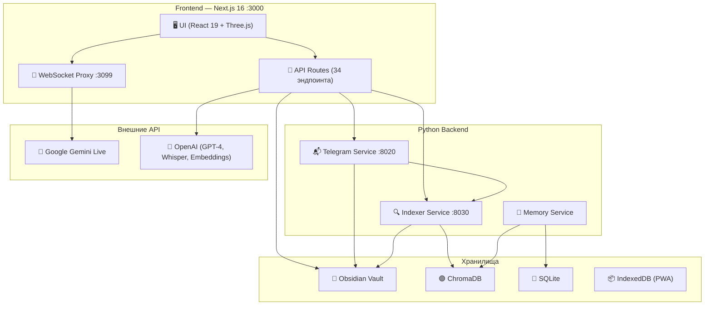
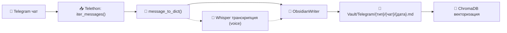
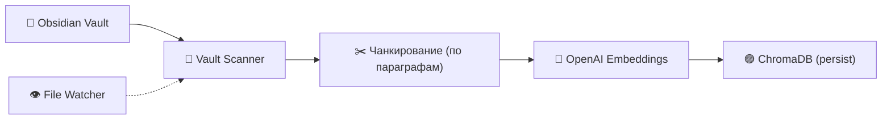

# 📖 VoiceZettel 2.0 — Полная документация проекта

> **AI Exocortex** — цифровое расширение разума. Голосовой ассистент + база знаний + Telegram-парсер + Obsidian-синхронизация.

---

## 🏗 Архитектура



### 7 Служб мониторинга (Дашборд)

| # | Служба | Порт | Технология | Описание |
|---|--------|------|------------|----------|
| 1 | **Веб-сервер** | :3000 | Next.js 16 | App Router, API Routes, UI |
| 2 | **Поиск и память** | :8030 | Python + ChromaDB | Векторная индексация, RAG-поиск |
| 3 | **Телеграм** | :8020 | Python + Telethon | Экспорт, Live-sync, транскрипция |
| 4 | **Obsidian** | :27124 | Obsidian REST API | Доступ к хранилищу заметок |
| 5 | **Голосовой канал** | :3099 | Node.js WS-прокси | WebSocket-мост к Gemini Live |
| 6 | **OpenAI** | API | GPT-4, Whisper, Embeddings | Текстовый мозг + транскрипция |
| 7 | **Live-синхронизация** | RT | Python (LiveSync) | Мониторинг новых сообщений в RT |

---

## 📁 Структура файлов

```
VoiceZettel/
├── src/                          # Frontend (TypeScript/React)
│   ├── app/                      # Next.js App Router
│   │   ├── page.tsx              # Главная страница
│   │   ├── layout.tsx            # Root layout + PWA
│   │   ├── globals.css           # Глобальные стили (тёмная тема, скроллбары)
│   │   ├── admin/page.tsx        # Админ-панель
│   │   ├── login/                # Страница входа
│   │   ├── offline/              # PWA offline-fallback
│   │   └── api/                  # 34 API-маршрута (см. ниже)
│   ├── components/               # React-компоненты
│   │   ├── admin/                # Панель администрирования
│   │   ├── chat/                 # Текстовый чат
│   │   ├── counters/             # Счётчики + анимации
│   │   ├── input/                # Панель ввода
│   │   ├── layout/               # Навигация, TopBar
│   │   ├── notes/                # Заметки (Zettelkasten UI)
│   │   ├── orb/                  # 3D Orb (Three.js)
│   │   ├── providers/            # Контексты React
│   │   ├── settings/             # Панель настроек
│   │   └── ui/                   # UI-примитивы (Button, Input...)
│   ├── hooks/                    # React-хуки
│   ├── lib/                      # Клиентские библиотеки
│   ├── stores/                   # Zustand стейт-менеджмент
│   └── types/                    # TypeScript типы
├── services/                     # Python backend
│   ├── telegram/                 # Telegram → Obsidian сервис
│   ├── indexer/                  # ChromaDB индексатор
│   ├── memory/                   # SQLite + ChromaDB memory
│   └── api/                      # Legacy Flask API (deprecated)
├── agents/                       # AI-агент «OpenClaw»
├── data/                         # SQLite БД + логи + настройки
├── scripts/                      # Скрипты запуска/авто-старта
├── ws-proxy.js                   # WebSocket прокси → Gemini Live
└── docker-compose.yml            # Docker-оркестрация
```

---

## 🎙 Модуль 1: Голосовой ассистент (Основной продукт)

### Голосовые клиенты

| Файл | Назначение |
|------|------------|
| [geminiLiveClient.ts](file:///C:/Users/anton/OneDrive/Документы/VoiceZettel/src/lib/geminiLiveClient.ts) | **WebSocket-клиент к Google Gemini Multimodal Live API.** Поддержка двунаправленного аудио (PCM 16kHz), системных инструкций, barge-in, function calling. |
| [realtimeVoiceClient.ts](file:///C:/Users/anton/OneDrive/Документы/VoiceZettel/src/lib/realtimeVoiceClient.ts) | **Клиент OpenAI Realtime API** (SDP). Альтернативный голосовой канал через WebRTC. |
| [localVoiceClient.ts](file:///C:/Users/anton/OneDrive/Документы/VoiceZettel/src/lib/localVoiceClient.ts) | **Локальный голосовой клиент.** Цепочка Browser STT → LLM → Local TTS. Работает без облака. |
| [browserSttClient.ts](file:///C:/Users/anton/OneDrive/Документы/VoiceZettel/src/lib/browserSttClient.ts) | **Web Speech API** обёртка для распознавания речи в браузере. |
| [yandexSttClient.ts](file:///C:/Users/anton/OneDrive/Документы/VoiceZettel/src/lib/yandexSttClient.ts) | **Yandex SpeechKit STT** (streaming gRPC-over-REST). |
| [ws-proxy.js](file:///C:/Users/anton/OneDrive/Документы/VoiceZettel/ws-proxy.js) | **WebSocket-прокси** Node.js (:3099). Мост между браузером и Gemini Live API. Логирует system_instruction, буферизует сообщения до готовности Gemini. |

### Голосовые хуки

| Файл | Назначение |
|------|------------|
| [useVoiceSession.ts](file:///C:/Users/anton/OneDrive/Документы/VoiceZettel/src/hooks/useVoiceSession.ts) | **Главный оркестратор голосовой сессии** (39 КБ). Управляет микрофоном, выбором провайдера (Gemini/OpenAI/Local), barge-in, таймерами тишины, записью контекста. |
| [useGeminiLiveSession.ts](file:///C:/Users/anton/OneDrive/Документы/VoiceZettel/src/hooks/useGeminiLiveSession.ts) | Хук для Gemini Live — инициализация WS, отправка аудио-чанков, приём ответов. |
| [useLavalierSession.ts](file:///C:/Users/anton/OneDrive/Документы/VoiceZettel/src/hooks/useLavalierSession.ts) | **«Режим петлички»** — фоновая запись с диаризацией спикеров. Для записи встреч/переговоров. |
| [useSpeechRecognition.ts](file:///C:/Users/anton/OneDrive/Документы/VoiceZettel/src/hooks/useSpeechRecognition.ts) | Хук для Web Speech API с автоматическим перезапуском. |
| [useElevenLabsTTS.ts](file:///C:/Users/anton/OneDrive/Документы/VoiceZettel/src/hooks/useElevenLabsTTS.ts) | Text-to-Speech через ElevenLabs API (streaming). |
| [voiceHelpers.ts](file:///C:/Users/anton/OneDrive/Документы/VoiceZettel/src/hooks/voiceHelpers.ts) | Утилиты: аудио-буферизация, конвертация PCM, определение тишины, функции записи. |

### TTS API-маршруты

| Маршрут | Технология |
|---------|------------|
| `/api/tts` | Edge TTS (Microsoft) — основной |
| `/api/tts-local` | Silero TTS (локальный) |
| `/api/tts-piper` | Piper TTS (локальный) |
| `/api/tts-qwen` | Qwen TTS |
| `/api/tts-yandex` | Yandex SpeechKit TTS |
| `/api/gemini-live-token` | Генерация SDP-токена для Gemini |
| `/api/realtime-token` | Токен OpenAI Realtime API |
| `/api/realtime-sdp` | SDP-обмен для OpenAI WebRTC |
| `/api/yandex-stt-token` | IAM-токен Yandex Cloud |

---

## 💬 Модуль 2: Текстовый чат с ИИ

### Компоненты

| Файл | Назначение |
|------|------------|
| [ChatArea.tsx](file:///C:/Users/anton/OneDrive/Документы/VoiceZettel/src/components/chat/ChatArea.tsx) | Область отображения сообщений (Markdown, код, таблицы). |
| [ChatSection.tsx](file:///C:/Users/anton/OneDrive/Документы/VoiceZettel/src/components/chat/ChatSection.tsx) | Контейнер чата. |
| [ArchiveButton.tsx](file:///C:/Users/anton/OneDrive/Документы/VoiceZettel/src/components/chat/ArchiveButton.tsx) | Кнопка архивации чата в Obsidian. |
| [InputBar.tsx](file:///C:/Users/anton/OneDrive/Документы/VoiceZettel/src/components/input/InputBar.tsx) | Панель ввода: текст + кнопка микрофона + отправка. |

### Хуки и библиотеки

| Файл | Назначение |
|------|------------|
| [useChatStream.ts](file:///C:/Users/anton/OneDrive/Документы/VoiceZettel/src/hooks/useChatStream.ts) | SSE-стриминг ответов ИИ через `/api/chat`. |
| [useTextChat.ts](file:///C:/Users/anton/OneDrive/Документы/VoiceZettel/src/hooks/useTextChat.ts) | Управление текстовым чатом: история, отправка, прерывание. |
| [useChatSync.ts](file:///C:/Users/anton/OneDrive/Документы/VoiceZettel/src/hooks/useChatSync.ts) | Синхронизация истории чата с сервером. |
| [chatContext.ts](file:///C:/Users/anton/OneDrive/Документы/VoiceZettel/src/lib/chatContext.ts) | **Формирование контекста для LLM** (14 КБ). Собирает: системный промпт из настроек, SOUL/STYLE/HEARTBEAT агента OpenClaw, Obsidian-заметки, RAG-данные из ChromaDB, историю чата, счётчики пользователя. |
| [chatTools.ts](file:///C:/Users/anton/OneDrive/Документы/VoiceZettel/src/lib/chatTools.ts) | **Function calling** для LLM: создание заметок, управление счётчиками, поиск, сохранение в Obsidian. |
| [sseStream.ts](file:///C:/Users/anton/OneDrive/Документы/VoiceZettel/src/lib/sseStream.ts) | Утилита для Server-Sent Events стриминга. |
| [messageClassifier.ts](file:///C:/Users/anton/OneDrive/Документы/VoiceZettel/src/lib/messageClassifier.ts) | Классификатор сообщений: определяет тип (вопрос, заметка, команда, инсайт) через LLM или эвристики. |

### Chat API

| Маршрут | Описание |
|---------|----------|
| `/api/chat` | SSE-стрим ответа LLM (поддержка OpenAI, Gemini, DeepSeek) |
| `/api/chat-history` | CRUD истории чатов |
| `/api/voice-context` | Формирование контекста для голосовой сессии |
| `/api/voice-memory` | Сохранение воспоминаний из голосового диалога |

---

## 🧠 Модуль 3: LLM-провайдеры

| Файл | Назначение |
|------|------------|
| [providers/base.ts](file:///C:/Users/anton/OneDrive/Документы/VoiceZettel/src/lib/providers/base.ts) | **Абстрактный интерфейс** `LLMProvider`: `chat()`, `stream()`, `embed()`. |
| [providers/openai.ts](file:///C:/Users/anton/OneDrive/Документы/VoiceZettel/src/lib/providers/openai.ts) | Реализация для OpenAI (GPT-4o, GPT-4o-mini, o-серия). |
| [providers/google.ts](file:///C:/Users/anton/OneDrive/Документы/VoiceZettel/src/lib/providers/google.ts) | Реализация для Google Gemini (Gemini 2.0 Flash/Pro). |
| [providers/deepseek.ts](file:///C:/Users/anton/OneDrive/Документы/VoiceZettel/src/lib/providers/deepseek.ts) | Реализация для DeepSeek API (V3, R1). |
| [providers/registry.ts](file:///C:/Users/anton/OneDrive/Документы/VoiceZettel/src/lib/providers/registry.ts) | Реестр провайдеров: `getProvider(name)`. |

---

## 🎨 Модуль 4: 3D-визуализация (Orb)

| Файл | Назначение |
|------|------------|
| [OrbArea.tsx](file:///C:/Users/anton/OneDrive/Документы/VoiceZettel/src/components/orb/OrbArea.tsx) | **Контейнер Orb-области** (8.5 КБ). Переключение между разными визуализациями, интеграция с голосовой сессией. |
| [ParticleOrb.tsx](file:///C:/Users/anton/OneDrive/Документы/VoiceZettel/src/components/orb/ParticleOrb.tsx) | **Particle Orb** (14.7 КБ). Система частиц Three.js, реагирует на аудио-уровень, меняет цвет по состоянию ИИ. |
| [ParticleHead.tsx](file:///C:/Users/anton/OneDrive/Документы/VoiceZettel/src/components/orb/ParticleHead.tsx) | **3D-голова из частиц** (18 КБ). Lip-sync визуализация с морфингом формы. |
| [AiOrb.tsx](file:///C:/Users/anton/OneDrive/Документы/VoiceZettel/src/components/orb/AiOrb.tsx) | Премиум-сфера с шейдерами и свечением. |
| [NebulaOrb.tsx](file:///C:/Users/anton/OneDrive/Документы/VoiceZettel/src/components/orb/NebulaOrb.tsx) | Туманность-визуализация. |
| [LavalierOrb.tsx](file:///C:/Users/anton/OneDrive/Документы/VoiceZettel/src/components/orb/LavalierOrb.tsx) | Специальный Orb для режима петлички — показывает спикеров, уровень звука. |
| [AgentOrb.tsx](file:///C:/Users/anton/OneDrive/Документы/VoiceZettel/src/components/orb/AgentOrb.tsx) | React-AI-Orb обёртка (npm-пакет). |
| [MeetingSummary.tsx](file:///C:/Users/anton/OneDrive/Документы/VoiceZettel/src/components/orb/MeetingSummary.tsx) | **Итоги встречи** (10.4 КБ). Отображает результат диаризации и транскрипции из режима петлички. |

### Семантические цвета Orb (из STYLE.md)

| Состояние | Цвет |
|-----------|------|
| Думает/ищет | 🔵 Синий/Циан |
| Подтверждение/сохранение | 🟢 Зелёный |
| Креатив/инсайт | 🟣 Фиолетовый |
| Ошибка | 🔴 Красный |
| Слушает | ⚪ Белый (пульсация) |

---

## 📊 Модуль 5: Счётчики и геймификация

| Файл | Назначение |
|------|------------|
| [TopCountersBar.tsx](file:///C:/Users/anton/OneDrive/Документы/VoiceZettel/src/components/counters/TopCountersBar.tsx) | Панель счётчиков вверху экрана: идеи, задачи, инсайты, custom-виджеты. |
| [FlyingIcon.tsx](file:///C:/Users/anton/OneDrive/Документы/VoiceZettel/src/components/counters/FlyingIcon.tsx) | Анимация «летящей иконки» при +1 к счётчику. |
| [ParticleBurst.tsx](file:///C:/Users/anton/OneDrive/Документы/VoiceZettel/src/components/counters/ParticleBurst.tsx) | Взрыв частиц как награда за действие. |
| [VisualEffects.tsx](file:///C:/Users/anton/OneDrive/Документы/VoiceZettel/src/components/counters/VisualEffects.tsx) | **Визуальные эффекты** (17 КБ): конфетти, фейерверк, snow, пульсация, starfield, vortex, aurora, matrix. |
| [countersStore.ts](file:///C:/Users/anton/OneDrive/Документы/VoiceZettel/src/stores/countersStore.ts) | Zustand стор: управление виджетами-счётчиками. |
| [detectCounterType.ts](file:///C:/Users/anton/OneDrive/Документы/VoiceZettel/src/lib/detectCounterType.ts) | Автоопределение типа счётчика из текста ИИ. |

---

## 📝 Модуль 6: Заметки (Zettelkasten)

| Файл | Назначение |
|------|------------|
| [NotesList.tsx](file:///C:/Users/anton/OneDrive/Документы/VoiceZettel/src/components/notes/NotesList.tsx) | **Список заметок** (22.8 КБ). Фильтрация, поиск, группировка, теги. |
| [NoteCard.tsx](file:///C:/Users/anton/OneDrive/Документы/VoiceZettel/src/components/notes/NoteCard.tsx) | Карточка заметки с превью. |
| [NoteView.tsx](file:///C:/Users/anton/OneDrive/Документы/VoiceZettel/src/components/notes/NoteView.tsx) | Просмотр заметки (Markdown-рендер). |
| [NoteEdit.tsx](file:///C:/Users/anton/OneDrive/Документы/VoiceZettel/src/components/notes/NoteEdit.tsx) | Редактор заметки (textarea + Markdown-preview). |
| [NotesPanel.tsx](file:///C:/Users/anton/OneDrive/Документы/VoiceZettel/src/components/notes/NotesPanel.tsx) | Контейнер панели заметок. |
| [notesStore.ts](file:///C:/Users/anton/OneDrive/Документы/VoiceZettel/src/stores/notesStore.ts) | Zustand стор: CRUD заметок. |
| [vaultWriter.ts](file:///C:/Users/anton/OneDrive/Документы/VoiceZettel/src/lib/vaultWriter.ts) | Запись заметок в Obsidian Vault через REST API. |
| [vaultContext.ts](file:///C:/Users/anton/OneDrive/Документы/VoiceZettel/src/lib/vaultContext.ts) | Чтение контекста из Obsidian Vault для RAG. |
| [obsidianClient.ts](file:///C:/Users/anton/OneDrive/Документы/VoiceZettel/src/lib/obsidianClient.ts) | HTTP-клиент к Obsidian Local REST API. |
| [obsidianVaultReader.ts](file:///C:/Users/anton/OneDrive/Документы/VoiceZettel/src/lib/obsidianVaultReader.ts) | Чтение файлов Vault (с кешированием). |

---

## ⚙️ Модуль 7: Настройки

| Файл | Назначение |
|------|------------|
| [SettingsPanel.tsx](file:///C:/Users/anton/OneDrive/Документы/VoiceZettel/src/components/settings/SettingsPanel.tsx) | **Главная панель настроек** (12.9 КБ). Вкладки: Голос, ИИ, Виджеты, Заметки, Obsidian, Агенты, Промпты, Логи. |
| [VoiceSection.tsx](file:///C:/Users/anton/OneDrive/Документы/VoiceZettel/src/components/settings/VoiceSection.tsx) | Настройки голоса: провайдер (Gemini/OpenAI/Local), модель, TTS, скорость, тишина. |
| [AiSection.tsx](file:///C:/Users/anton/OneDrive/Документы/VoiceZettel/src/components/settings/AiSection.tsx) | Настройки LLM: модель, RAG-чанки, макс. контекст, температура. |
| [WidgetsSection.tsx](file:///C:/Users/anton/OneDrive/Документы/VoiceZettel/src/components/settings/WidgetsSection.tsx) | **Визуальные виджеты** (14.8 КБ). Drag & drop виджетов, настройка иконок, цветов, целей. |
| [AddWidgetScreen.tsx](file:///C:/Users/anton/OneDrive/Документы/VoiceZettel/src/components/settings/AddWidgetScreen.tsx) | Экран создания нового виджета-счётчика. |
| [IconPicker.tsx](file:///C:/Users/anton/OneDrive/Документы/VoiceZettel/src/components/settings/IconPicker.tsx) | Выбор иконки (100+ из Lucide + preview). |
| [PromptsSection.tsx](file:///C:/Users/anton/OneDrive/Документы/VoiceZettel/src/components/settings/PromptsSection.tsx) | Редактор системного промпта ИИ. |
| [ObsidianSection.tsx](file:///C:/Users/anton/OneDrive/Документы/VoiceZettel/src/components/settings/ObsidianSection.tsx) | Настройки подключения к Obsidian Vault. |
| [AgentsSection.tsx](file:///C:/Users/anton/OneDrive/Документы/VoiceZettel/src/components/settings/AgentsSection.tsx) | Настройки AI-агентов (OpenClaw). |
| [NotesSection.tsx](file:///C:/Users/anton/OneDrive/Документы/VoiceZettel/src/components/settings/NotesSection.tsx) | Настройки заметок. |
| [LogsSection.tsx](file:///C:/Users/anton/OneDrive/Документы/VoiceZettel/src/components/settings/LogsSection.tsx) | Просмотр логов клиентской части. |
| [settingsStore.ts](file:///C:/Users/anton/OneDrive/Документы/VoiceZettel/src/stores/settingsStore.ts) | **Zustand стор настроек** (16.3 КБ). Все параметры системы: голос, модель, TTS, виджеты, промпты, визуальные эффекты, сессия. Автосохранение на сервер. |
| [useSettingsSync.ts](file:///C:/Users/anton/OneDrive/Документы/VoiceZettel/src/hooks/useSettingsSync.ts) | Синхронизация настроек между вкладками/устройствами. |

---

## 🛡 Модуль 8: Администрирование

### Вкладки админ-панели (`/admin`)

| Файл | Вкладка | Назначение |
|------|---------|------------|
| [DashboardTab.tsx](file:///C:/Users/anton/OneDrive/Документы/VoiceZettel/src/components/admin/DashboardTab.tsx) | **Дашборд** (65 КБ) | Мониторинг 7 служб, здоровье системы, автолечение, векторизация, статистика, API-лимиты, пайплайн данных. |
| [TelegramTab.tsx](file:///C:/Users/anton/OneDrive/Документы/VoiceZettel/src/components/admin/TelegramTab.tsx) | **Telegram** (74.5 КБ) | Авторизация, экспорт в Obsidian, Live-синхронизация, лента сообщений, транскрипция, управление чатами. |
| [LogsTab.tsx](file:///C:/Users/anton/OneDrive/Документы/VoiceZettel/src/components/admin/LogsTab.tsx) | **Логи** | Просмотр логов всех модулей в реальном времени. |
| [PromptsTab.tsx](file:///C:/Users/anton/OneDrive/Документы/VoiceZettel/src/components/admin/PromptsTab.tsx) | **Промпты** | Редактирование системных промптов. |
| [UsersTab.tsx](file:///C:/Users/anton/OneDrive/Документы/VoiceZettel/src/components/admin/UsersTab.tsx) | **Пользователи** | Управление списком авторизованных пользователей. |
| [AdminSidebar.tsx](file:///C:/Users/anton/OneDrive/Документы/VoiceZettel/src/components/admin/AdminSidebar.tsx) | Сайдбар | Навигация по вкладкам + статус системы. |

### Функции Дашборда

- **Здоровье системы**: проверка 7 сервисов с latency, русскоязычными описаниями ошибок
- **Голосовой ассистент**: 5 подпроверок (Gemini API, ключ, WS-прокси, ChromaDB, Obsidian)
- **Автолечение**: `POST /api/auto-heal` — автоматическое исправление проблем
- **Векторизация**: прогресс ChromaDB, кнопка полной переиндексации
- **Telegram Live**: статистика сообщений, прогресс экспорта
- **API-лимиты**: баланс OpenAI, лимиты запросов
- **Системный промпт**: отображение текущей модели и параметров RAG
- **Пайплайн данных**: `Telegram → Obsidian → ChromaDB → Gemini Live`
- **Системные ресурсы**: RAM и CPU в реальном времени

---

## 📬 Модуль 9: Telegram Service (Python :8020)

### Файлы сервиса

| Файл | Назначение |
|------|------------|
| [main.py](file:///C:/Users/anton/OneDrive/Документы/VoiceZettel/services/telegram/main.py) | **FastAPI-сервер** (34.8 КБ). 20+ эндпоинтов. Авторизация Telethon, очередь экспорта, Live sync, транскрипция. |
| [exporter.py](file:///C:/Users/anton/OneDrive/Документы/VoiceZettel/services/telegram/exporter.py) | **Парсер сообщений** (14.8 КБ). `TelegramExporter` — загрузка истории чата, `message_to_dict()` — конвертация сообщений (текст, медиа, ответы, форварды, reactions). |
| [obsidian_writer.py](file:///C:/Users/anton/OneDrive/Документы/VoiceZettel/services/telegram/obsidian_writer.py) | **Запись в Obsidian** (12.5 КБ). Форматирование Markdown, создание файлов `Telegram/{тип}/{чат}/{дата}.md`, REST API или прямая запись. |
| [live_sync.py](file:///C:/Users/anton/OneDrive/Документы/VoiceZettel/services/telegram/live_sync.py) | **Live-синхронизация** (11.9 КБ). Telethon event handler для новых сообщений → Obsidian → ChromaDB. Фильтрация, исключение чатов, транскрипция голосовых. |
| [export_tracker.py](file:///C:/Users/anton/OneDrive/Документы/VoiceZettel/services/telegram/export_tracker.py) | **Трекер экспорта** (8.3 КБ). JSON-файл с прогрессом по каждому чату: статус, количество, дата. |
| [transcriber.py](file:///C:/Users/anton/OneDrive/Документы/VoiceZettel/services/telegram/transcriber.py) | **Транскрибирование** (4.9 КБ). OpenAI Whisper API для голосовых сообщений Telegram. |

### API-эндпоинты Telegram-сервиса

| Метод | Путь | Описание |
|-------|------|----------|
| POST | `/auth/connect` | Подключение к Telegram (api_id, api_hash) |
| POST | `/auth/verify-code` | Подтверждение кодом из Telegram |
| POST | `/auth/verify-2fa` | Двухфакторная авторизация |
| GET | `/auth/status` | Статус авторизации |
| GET | `/health` | Проверка здоровья сервиса |
| GET | `/chats` | Список чатов пользователя |
| POST | `/export/start` | Запуск экспорта чатов в Obsidian |
| POST | `/export/stop` | Остановка экспорта |
| GET | `/export/status` | Статус экспорта |
| GET | `/export/queue` | Очередь экспорта |
| POST | `/export/queue/retry` | Перезапуск ошибочных чатов |
| POST | `/sync/start` | Запуск Live-синхронизации |
| POST | `/sync/stop` | Остановка Live-синхронизации |
| GET | `/sync/status` | Статус Live-синхронизации |
| POST | `/sync/filter` | Обновление фильтра чатов |
| POST | `/sync/exclude` | Исключение чата из мониторинга |
| POST | `/sync/unexclude` | Возврат чата в мониторинг |
| DELETE | `/sync/recent/{index}` | Удаление сообщения из ленты |
| DELETE | `/sync/recent` | Очистка ленты |
| GET | `/export/logs` | Журнал экспорта |

### Пайплайн экспорта



### Обработка ошибок (русский язык)

Система классифицирует ошибки и показывает понятные описания:
- **FloodWait** → «Telegram ограничил запросы. Подождите X секунд.»
- **Connection** → «Ошибка подключения к Telegram.»
- **Permission** → «Нет доступа к чату.»
- **DiskSpace** → «Недостаточно места на диске.»
- **Auth** → «Сессия Telegram истекла.»
- **Vectorization** → «Ошибка при векторизации.»
- **AttributeError** → «Внутренняя ошибка парсинга.»

---

## 🔍 Модуль 10: Indexer Service (Python :8030)

### Файлы

| Файл | Назначение |
|------|------------|
| [main.py](file:///C:/Users/anton/OneDrive/Документы/VoiceZettel/services/indexer/main.py) | **FastAPI-сервер** (12 КБ). Индексация файлов из Obsidian Vault в ChromaDB. Полная и инкрементная индексация. |
| [vault_scanner.py](file:///C:/Users/anton/OneDrive/Документы/VoiceZettel/services/indexer/vault_scanner.py) | **Сканер Vault** (8 КБ). Рекурсивный обход Markdown-файлов, чанкирование текста, извлечение метаданных. |
| [watcher.py](file:///C:/Users/anton/OneDrive/Документы/VoiceZettel/services/indexer/watcher.py) | **File Watcher** (3.3 КБ). Watchdog для отслеживания изменений файлов и автоматической переиндексации. |
| [embedder.py](file:///C:/Users/anton/OneDrive/Документы/VoiceZettel/services/indexer/embedder.py) | **Embedder** (4.1 КБ). Генерация векторов через OpenAI `text-embedding-3-small` с кешированием. |

### API-эндпоинты

| Метод | Путь | Описание |
|-------|------|----------|
| GET | `/health` | Проверка здоровья (ChromaDB OK, документы, watcher) |
| GET | `/stats` | Статистика: чанки, документы, источники, ошибки |
| POST | `/index/full` | Полная переиндексация всего Vault |
| POST | `/index/file` | Индексация одного файла |
| GET | `/search` | Семантический поиск по ChromaDB |

### Пайплайн индексации



---

## 🧠 Модуль 11: Memory Service

| Файл | Назначение |
|------|------------|
| [sqlite_service.py](file:///C:/Users/anton/OneDrive/Документы/VoiceZettel/services/memory/sqlite_service.py) | SQLite-хранилище для структурированных данных: настройки, чаты, пользователи. |
| [chroma_service.py](file:///C:/Users/anton/OneDrive/Документы/VoiceZettel/services/memory/chroma_service.py) | Обёртка ChromaDB для работы с коллекциями и поиском. |
| [memoryStore.ts](file:///C:/Users/anton/OneDrive/Документы/VoiceZettel/src/lib/memoryStore.ts) | Клиентская память: кеш сессий, предпочтения, офлайн-буфер. |
| [embeddings.ts](file:///C:/Users/anton/OneDrive/Документы/VoiceZettel/src/lib/embeddings.ts) | Генерация эмбеддингов на клиенте. |

---

## 🤖 Модуль 12: AI-агент «OpenClaw»

### Файлы конфигурации

| Файл | Назначение |
|------|------------|
| [SOUL.md](file:///C:/Users/anton/OneDrive/Документы/VoiceZettel/agents/SOUL.md) | **Идентичность**: Автономный AI Exocortex. Захват, организация и синтез информации. 5 ценностей: точность, постоянство, синтез, прозрачность, автономия. |
| [STYLE.md](file:///C:/Users/anton/OneDrive/Документы/VoiceZettel/agents/STYLE.md) | **Стиль общения**: профессиональный, лаконичный, barge-in safe. Семантические цвета Orb. |
| [HEARTBEAT.md](file:///C:/Users/anton/OneDrive/Документы/VoiceZettel/agents/HEARTBEAT.md) | **Фоновая логика**: расписание синхронизации (Obsidian 2s, Telegram 24/7, Shelestun 5min). Обслуживание: вакуум БД, ротация логов. |

---

## 🔐 Модуль 13: Аутентификация и безопасность

| Файл | Назначение |
|------|------------|
| [auth.ts](file:///C:/Users/anton/OneDrive/Документы/VoiceZettel/src/lib/auth.ts) | **NextAuth v5** конфигурация. Google OAuth. Привязка сессий. |
| [allowedUsers.ts](file:///C:/Users/anton/OneDrive/Документы/VoiceZettel/src/lib/allowedUsers.ts) | Белый список пользователей (из `data/allowed_users.json`). |
| [middleware.ts](file:///C:/Users/anton/OneDrive/Документы/VoiceZettel/src/middleware.ts) | Next.js middleware — аутентификация для всех страниц, исключая API-эндпоинты сервисов. |
| `/api/auth/[...nextauth]` | NextAuth маршрут: login, callback, signout. |
| `/api/users` | CRUD пользователей (админ). |

---

## 📡 Модуль 14: API Routes (34 маршрута)

### Категории

| Категория | Маршруты | Описание |
|-----------|----------|----------|
| **Здоровье** | `/api/health`, `/api/health-openai`, `/api/voice-health`, `/api/local-health` | Мониторинг всех сервисов |
| **ИИ** | `/api/chat`, `/api/voice-context`, `/api/voice-memory`, `/api/debug-context` | Текстовый чат и контекст |
| **Голос** | `/api/tts`, `/api/tts-*` (5 вариантов), `/api/gemini-live-*`, `/api/realtime-*`, `/api/yandex-stt-token` | TTS/STT/Realtime |
| **Память** | `/api/memories`, `/api/chat-history`, `/api/meeting-summary` | Сохранение и поиск |
| **Настройки** | `/api/settings`, `/api/preferences` | CRUD настроек |
| **Сервисы** | `/api/telegram/[...path]`, `/api/indexer/[...path]`, `/api/obsidian/[...path]` | Проксирование к Python-сервисам |
| **Админ** | `/api/auto-heal`, `/api/api-credits`, `/api/users`, `/api/logs`, `/api/token-usage` | Администрирование |

---

## 🗄 Модуль 15: Zustand State Management

| Файл | Назначение |
|------|------------|
| [settingsStore.ts](file:///C:/Users/anton/OneDrive/Документы/VoiceZettel/src/stores/settingsStore.ts) | **Настройки** (16.3 КБ): модель, голос, TTS, RAG, виджеты, промпт, тема, эффекты. Автосохранение на сервер. |
| [chatStore.ts](file:///C:/Users/anton/OneDrive/Документы/VoiceZettel/src/stores/chatStore.ts) | **Чат**: сообщения, загрузка, стриминг. |
| [notesStore.ts](file:///C:/Users/anton/OneDrive/Документы/VoiceZettel/src/stores/notesStore.ts) | **Заметки**: CRUD, фильтрация, синхронизация с Obsidian. |
| [countersStore.ts](file:///C:/Users/anton/OneDrive/Документы/VoiceZettel/src/stores/countersStore.ts) | **Счётчики**: управление виджетами, инкремент/декремент, цели. |
| [animationStore.ts](file:///C:/Users/anton/OneDrive/Документы/VoiceZettel/src/stores/animationStore.ts) | **Анимации**: состояние Orb, аудио-уровень, цвет, пульс. |
| [adminStore.ts](file:///C:/Users/anton/OneDrive/Документы/VoiceZettel/src/stores/adminStore.ts) | **Админ**: текущая вкладка, статус. |
| [lavalierStore.ts](file:///C:/Users/anton/OneDrive/Документы/VoiceZettel/src/stores/lavalierStore.ts) | **Петличка**: состояние записи, спикеры, транскрипты. |
| [notificationStore.ts](file:///C:/Users/anton/OneDrive/Документы/VoiceZettel/src/stores/notificationStore.ts) | **Уведомления**: очередь нотификаций. |
| [rewardStore.ts](file:///C:/Users/anton/OneDrive/Документы/VoiceZettel/src/stores/rewardStore.ts) | **Награды**: триггеры визуальных эффектов. |

---

## 🎨 Модуль 16: Layout и навигация

| Файл | Назначение |
|------|------------|
| [MainLayout.tsx](file:///C:/Users/anton/OneDrive/Документы/VoiceZettel/src/components/layout/MainLayout.tsx) | Главный layout: TopBar + OrbArea + ChatArea + InputBar + NotesPanel. |
| [TopBar.tsx](file:///C:/Users/anton/OneDrive/Документы/VoiceZettel/src/components/layout/TopBar.tsx) | Верхняя панель: логотип, кнопка настроек, кнопка админки, аватар, logout. |
| [NotificationBell.tsx](file:///C:/Users/anton/OneDrive/Документы/VoiceZettel/src/components/layout/NotificationBell.tsx) | Колокольчик уведомлений (8.9 КБ). |
| [ChangelogNotifier.tsx](file:///C:/Users/anton/OneDrive/Документы/VoiceZettel/src/components/layout/ChangelogNotifier.tsx) | Уведомление о новых функциях. |
| [DevOverlaySuppressor.tsx](file:///C:/Users/anton/OneDrive/Документы/VoiceZettel/src/components/layout/DevOverlaySuppressor.tsx) | Подавление Next.js dev overlay. |

---

## 🔊 Модуль 17: Звуки и аудио

| Файл | Назначение |
|------|------------|
| [sounds.ts](file:///C:/Users/anton/OneDrive/Документы/VoiceZettel/src/lib/sounds.ts) | **Звуковая система** (16.9 КБ). Генерация звуков через Web Audio API: подключение, отключение, получение/отправка сообщения, ошибка, +1 счётчик, достижение цели. Тональная палитра частот. |

---

## 🐳 Модуль 18: Инфраструктура

### Docker Compose

6 сервисов: `frontend`, `api`, `chromadb`, `sqlite`, `telegram`, `indexer` + `nginx` reverse proxy.

### Скрипты запуска

| Файл | Назначение |
|------|------------|
| [start-all.bat](file:///C:/Users/anton/OneDrive/Документы/VoiceZettel/scripts/start-all.bat) | **Запуск ВСЕГО** (6.6 КБ): Next.js + WS-Proxy + Indexer + Telegram. |
| [restart-all.bat](file:///C:/Users/anton/OneDrive/Документы/VoiceZettel/scripts/restart-all.bat) | Перезапуск всех сервисов с kill. |
| [start-with-tunnel.ps1](file:///C:/Users/anton/OneDrive/Документы/VoiceZettel/scripts/start-with-tunnel.ps1) | Запуск с Cloudflare Tunnel (внешний доступ). |
| [setup-vault.ps1](file:///C:/Users/anton/OneDrive/Документы/VoiceZettel/scripts/setup-vault.ps1) | Настройка Obsidian Vault (создание папок, шаблоны). |
| [VoiceZettel-Autostart.vbs](file:///C:/Users/anton/OneDrive/Документы/VoiceZettel/scripts/VoiceZettel-Autostart.vbs) | Автозапуск при входе в Windows. |

---

## 📊 Модуль 19: Типы TypeScript

| Файл | Описание |
|------|----------|
| [admin.ts](file:///C:/Users/anton/OneDrive/Документы/VoiceZettel/src/types/admin.ts) | Типы для админ-панели: `ServiceHealth`, `ExportStatus`, `SyncStatus`. |
| [animation.ts](file:///C:/Users/anton/OneDrive/Документы/VoiceZettel/src/types/animation.ts) | Типы анимаций: `OrbState`, `AnimationParams`, `EffectType`. |
| [chat.ts](file:///C:/Users/anton/OneDrive/Документы/VoiceZettel/src/types/chat.ts) | Типы чата: `Message`, `ChatSession`. |
| [counters.ts](file:///C:/Users/anton/OneDrive/Документы/VoiceZettel/src/types/counters.ts) | Типы счётчиков: `Widget`, `WidgetConfig`, `CounterEvent`. |
| [voice.ts](file:///C:/Users/anton/OneDrive/Документы/VoiceZettel/src/types/voice.ts) | Типы голоса: `VoiceProvider`, `SessionState`, `AudioChunk`. |
| [notes.ts](file:///C:/Users/anton/OneDrive/Документы/VoiceZettel/src/types/notes.ts) | Типы заметок: `Note`, `NoteFilter`, `NoteType`. |
| [lavalier.ts](file:///C:/Users/anton/OneDrive/Документы/VoiceZettel/src/types/lavalier.ts) | Типы петлички: `Speaker`, `Transcript`, `MeetingData`. |
| [tokenUsage.ts](file:///C:/Users/anton/OneDrive/Документы/VoiceZettel/src/types/tokenUsage.ts) | Типы учёта токенов. |
| [tts.ts](file:///C:/Users/anton/OneDrive/Документы/VoiceZettel/src/types/tts.ts) | Типы TTS: `TTSProvider`, `TTSConfig`. |
| [reward.ts](file:///C:/Users/anton/OneDrive/Документы/VoiceZettel/src/types/reward.ts) | Типы наград и эффектов. |
| [memory.ts](file:///C:/Users/anton/OneDrive/Документы/VoiceZettel/src/types/memory.ts) | Типы памяти: `MemoryItem`. |
| [obsidian.ts](file:///C:/Users/anton/OneDrive/Документы/VoiceZettel/src/types/obsidian.ts) | Типы Obsidian: `VaultFile`, `SearchResult`. |
| [notification.ts](file:///C:/Users/anton/OneDrive/Документы/VoiceZettel/src/types/notification.ts) | Типы уведомлений. |

---

## 🌐 Утилиты

| Файл | Назначение |
|------|------------|
| [logger.ts](file:///C:/Users/anton/OneDrive/Документы/VoiceZettel/src/lib/logger.ts) | Серверный логгер с уровнями и таймстемпами. |
| [remoteLogger.ts](file:///C:/Users/anton/OneDrive/Документы/VoiceZettel/src/lib/remoteLogger.ts) | Отправка клиентских логов на сервер. |
| [tokenPricing.ts](file:///C:/Users/anton/OneDrive/Документы/VoiceZettel/src/lib/tokenPricing.ts) | Расчёт стоимости токенов по моделям. |
| [stripMarkdown.ts](file:///C:/Users/anton/OneDrive/Документы/VoiceZettel/src/lib/stripMarkdown.ts) | Очистка Markdown для TTS. |
| [stripDSML.ts](file:///C:/Users/anton/OneDrive/Документы/VoiceZettel/src/lib/stripDSML.ts) | Очистка DSML (Dynamic Speech Markup Language). |
| [parseDSML.ts](file:///C:/Users/anton/OneDrive/Документы/VoiceZettel/src/lib/parseDSML.ts) | Парсинг DSML-разметки для голоса. |
| [detectPreference.ts](file:///C:/Users/anton/OneDrive/Документы/VoiceZettel/src/lib/detectPreference.ts) | Определение предпочтений пользователя из текста. |
| [changelog.ts](file:///C:/Users/anton/OneDrive/Документы/VoiceZettel/src/lib/changelog.ts) | Список изменений для уведомления пользователей. |
| [db.ts](file:///C:/Users/anton/OneDrive/Документы/VoiceZettel/src/lib/db.ts) | SQLite подключение (`better-sqlite3`). |
| [utils.ts](file:///C:/Users/anton/OneDrive/Документы/VoiceZettel/src/lib/utils.ts) | Утилиты (cn для Tailwind). |

---

## 📈 Статистика проекта

| Метрика | Значение |
|---------|----------|
| **TypeScript файлов** | ~70 |
| **Python файлов** | ~12 |
| **React компонентов** | ~50 |
| **API маршрутов** | 34 |
| **Zustand сторов** | 9 |
| **React хуков** | 10 |
| **LLM-провайдеров** | 3 (OpenAI, Gemini, DeepSeek) |
| **TTS-провайдеров** | 5 (Edge, Silero, Piper, Qwen, Yandex) |
| **STT-провайдеров** | 3 (Browser, Yandex, OpenAI Whisper) |
| **Голосовых клиентов** | 3 (Gemini Live, OpenAI Realtime, Local) |
| **3D-визуализаций** | 5 (ParticleOrb, ParticleHead, Nebula, AiOrb, Lavalier) |
| **Визуальных эффектов** | 8+ (confetti, firework, snow, starfield, aurora, matrix...) |
| **Docker-сервисов** | 6 |
| **Размер кода (TS)** | ~450 КБ |
| **Размер кода (Python)** | ~100 КБ |

---

## 🔄 Потоки данных

### Голосовой диалог
```
🎤 Микрофон → PCM 16kHz → ws-proxy.js → Gemini Live API → Аудио-ответ → 🔊 Динамик
                                 ↕
                          chatContext.ts (RAG из ChromaDB + Obsidian)
```

### Текстовый чат
```
⌨️ InputBar → /api/chat (SSE) → LLM Provider (Gemini/OpenAI/DeepSeek) → Markdown → ChatArea
                    ↕
            chatContext.ts + chatTools.ts (function calling)
```

### Telegram → Знания
```
📱 Telegram → Telethon → message_to_dict() → ObsidianWriter → 📓 Vault/Telegram/
                                                                     ↓
                                                              ChromaDB Index ← Vault Scanner
```

### Live Sync (реальное время)
```
📱 Новое сообщение → LiveSync event handler → ObsidianWriter → ChromaDB → Gemini знает!
```
