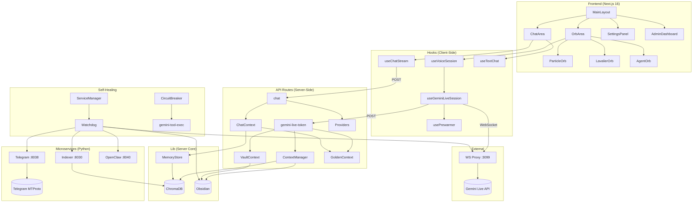
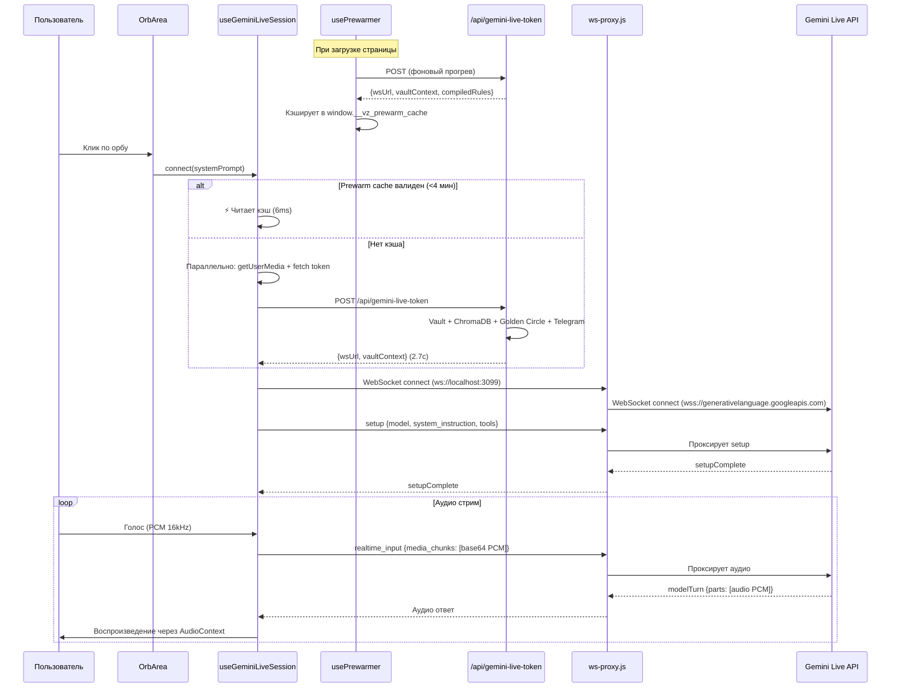
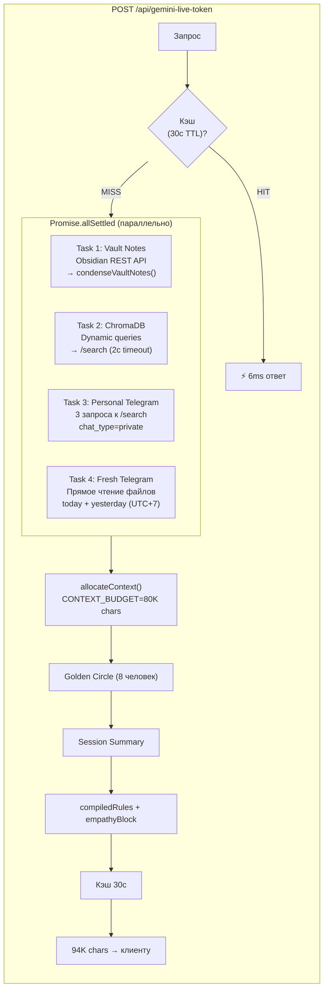
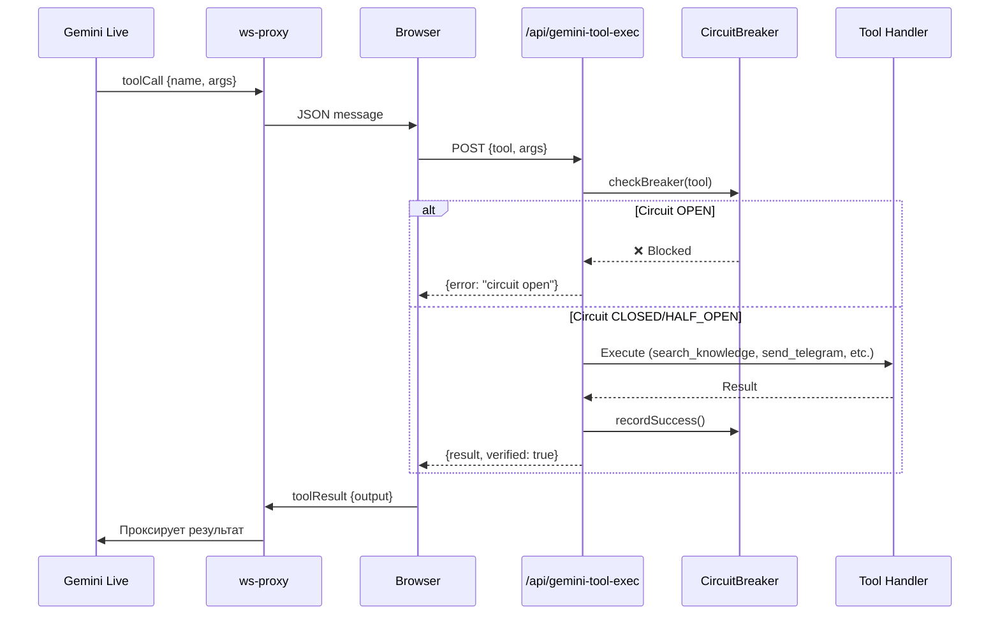
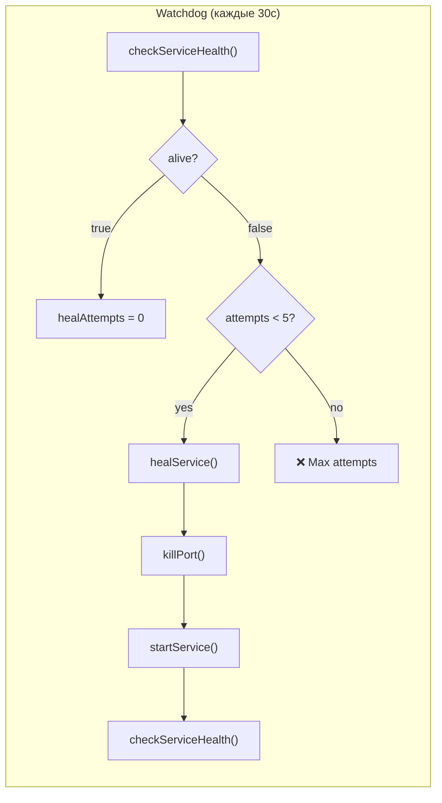
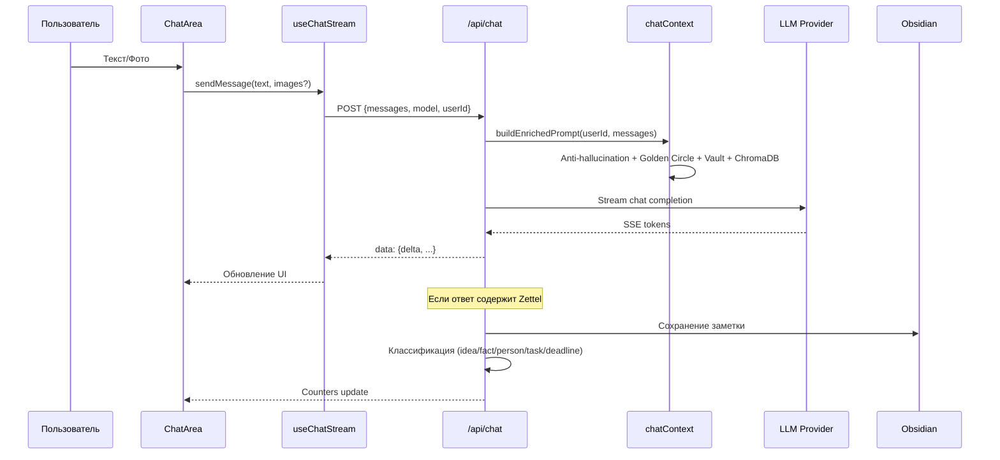
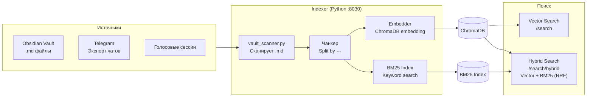

# 📖 VoiceZettel 2.0 — Полная документация проекта

> **Версия:** 2.0 (Antigravity)  
> **Стек:** Next.js 16 (App Router) + React 19 + TypeScript + FastAPI + ChromaDB + Gemini API  
> **Назначение:** AI-экзокортекс — голосовой ассистент с долговременной памятью, интеграцией Telegram, Obsidian, Google Workspace

---

## 🏗 Архитектура системы



---

## 📂 Структура проекта

```
VoiceZettel/
├── src/
│   ├── app/                    # Next.js App Router
│   │   ├── api/                # 72 API маршрута
│   │   ├── admin/              # Админ-панель
│   │   └── page.tsx            # Главная (Orb)
│   ├── components/             # ~65 React компонентов
│   │   ├── admin/              # Дашборд, логи, телеграм
│   │   ├── orb/                # 3D Orb визуализация
│   │   ├── chat/               # Текстовый чат
│   │   ├── settings/           # Настройки
│   │   └── layout/             # Лейаут, TopBar
│   ├── hooks/                  # 11 React хуков
│   ├── lib/                    # 48 серверных модулей
│   │   └── providers/          # LLM провайдеры
│   ├── stores/                 # 10 Zustand сторов
│   └── types/                  # TypeScript типы
├── services/
│   ├── indexer/                # Python ChromaDB индексер
│   └── telegram/               # Python Telegram парсер
├── ws-proxy.js                 # WebSocket прокси → Gemini
└── data/                       # Данные (память, логи)
```

---

# 🔬 МОДУЛЬ 1: Голосовой пайплайн (Voice Pipeline)

## Пайплайн: Клик → Голос → Ответ



---

## `ws-proxy.js` — WebSocket прокси

**Путь:** `/ws-proxy.js`  
**Порт:** 3099  
**Назначение:** Мост между браузером и Gemini Live API. Браузер не может напрямую подключаться к Gemini (CORS + API key).

| Функция | Описание |
|---------|----------|
| Буферизация | Если Gemini WS ещё не открыт, сообщения клиента буферизуются в `pendingMessages` |
| Логирование setup | Парсит JSON setup-сообщение, логирует длину system_instruction, наличие контекста (Настя, Константин, tools) |
| Запись last_setup | Сохраняет `data/last_setup.json` для диагностики |
| Проксирование | Client → Gemini + Gemini → Client (прозрачно) |

---

## `src/hooks/useGeminiLiveSession.ts` — Главный голосовой хук

**Назначение:** Управление WebSocket сессией с Gemini Live API. Это ядро голосового ассистента.

| Функция | Описание |
|---------|----------|
| `connect(systemPrompt?)` | Подключение к Gemini. **Быстрый путь:** если prewarm кэш валиден — мгновенное подключение (6ms). **Параллельный путь:** mic + token одновременно (~2.7с) |
| `disconnect()` | Намеренное отключение. Устанавливает `intentionalClose=true`, останавливает микрофон, закрывает WS |
| `handleMessage(event)` | Обработка входящих сообщений: `setupComplete`, `inputTranscription` (что сказал пользователь), `outputTranscription` (что ответил ассистент), аудио-части (PCM → `playPcmAudio`) |
| `playPcmAudio(base64)` | Декодирование base64 → Int16 PCM → Float32 → AudioBuffer → воспроизведение через WebAudio |
| `startMicCapture(ws, stream)` | Захват микрофона: AudioContext(16kHz) → ScriptProcessor(4096) → Float32→Int16 PCM → base64 → JSON → WS |
| `cleanupMic()` | Освобождение ресурсов: processor, AudioContext, MediaStream tracks |
| `triggerSessionAnalysis()` | По завершении сессии отправляет транскрипт на `/api/session-analytics` для анализа |

**Reconnect:**
- 5 попыток с exponential backoff (1с → 2с → 4с → 8с → 16с)
- Сброс retry counter при успешном `setupComplete`
- Логирование: `⚡ Reconnecting X/5`, `❌ Max attempts reached`

**Состояния:**
- `isConnected` — WebSocket открыт и setup завершён
- `isReconnecting` — идёт попытка переподключения
- `transcript` — накопленный текст транскрипции

---

## `src/hooks/usePrewarmer.ts` — Фоновый прогрев

**Назначение:** Прогревает все зависимости голосового канала ДО того, как пользователь нажмёт кнопку.

| Функция | Описание |
|---------|----------|
| `prewarm()` | Запускает 5 параллельных задач прогрева |
| `readPrewarmCache()` | Глобальный getter кэша (window.__vz_prewarm_cache) |
| `invalidatePrewarmCache()` | Сброс кэша + освобождение mic stream |

**Прогреваемые ресурсы:**

| # | Ресурс | Таймаут | Описание |
|---|--------|---------|----------|
| 1 | Микрофон | — | `getUserMedia()` → phantom mode (track.enabled=false) |
| 2 | Gemini token | 10с | `POST /api/gemini-live-token` → wsUrl + контекст |
| 3 | OpenAI Realtime token | 5с | `GET /api/realtime-token` |
| 4 | Local Core health | 2с | `GET /api/local-health` |
| 5 | TTS серверы | 5с | POST к tts-local, tts-piper, tts-qwen, tts (Edge) |

**Автоочистка:**
- Phantom mic освобождается через `prewarmTimeoutMinutes` (по умолчанию 5 мин)
- При `visibilitychange` (скрытие вкладки) — mic отпускается для Zoom/Teams
- При возврате — prewarm перезапускается

---

## `src/hooks/useVoiceSession.ts` — Оркестратор голосовых сессий

**Назначение:** Абстракция над разными голосовыми движками. Выбирает между Gemini Live, OpenAI Realtime, и Local Core.

| Функция | Описание |
|---------|----------|
| `startVoice()` | Определяет движок по настройкам → вызывает соответствующий connect |
| `stopVoice()` | Останавливает активную сессию |
| `interruptSpeaking()` | Прерывание TTS (tap-to-interrupt) |
| `isVoiceActive` | Текущее состояние |

---

## `src/hooks/useChatStream.ts` — Стриминг текстового чата

**Назначение:** SSE streaming для текстовых ответов LLM.

| Функция | Описание |
|---------|----------|
| `sendMessage(text, images?)` | POST → `/api/chat` → SSE stream → парсинг `data:` событий |
| `cancelStream()` | Abort текущего fetch |

---

## `src/hooks/usePrewarmer.ts` — описан выше

## `src/hooks/useLavalierSession.ts` — Lapel-режим

**Назначение:** Фоновая запись и анализ встреч. Непрерывная запись без кнопки.

---

# 🔬 МОДУЛЬ 2: Контекст и память (Context & Memory Pipeline)

## Пайплайн: Сборка контекста для голосовой сессии



---

## `src/app/api/gemini-live-token/route.ts` — Построитель контекста

**Метод:** POST  
**Время ответа:** 6ms (cache hit) / 2.7с (cold)

| Функция | Описание |
|---------|----------|
| `POST()` | Основной обработчик. Собирает полный контекст из 4+ источников параллельно |
| `condenseVaultNotes(raw)` | Сжимает заметки Obsidian: извлекает title + essence, дедуплицирует по нормализованному заголовку, возвращает bulletpoints |

**4 параллельных задачи:**

| # | Задача | Источник | Таймаут |
|---|--------|----------|---------|
| 1 | Vault Notes | Obsidian REST API → `loadVaultContext()` → `condenseVaultNotes()` | — |
| 2 | ChromaDB general | `GET /search` × N dynamic queries (top_k=5 каждый) | 2с |
| 3 | Personal Telegram | `GET /search` × 3 запроса (chat_type=private) | 2с |
| 4 | Fresh Telegram files | Прямое чтение .md файлов с диска для inner circle (circle ≤ 2) | — |

**Постобработка:**
1. Контекст передаётся в `allocateContext()` с бюджетом 80K chars
2. Golden Circle блок добавляется ПЕРВЫМ (8 человек с алиасами)
3. Session summary из предыдущей сессии
4. `compiledRules` — синтезированные правила поведения
5. `empathyBlock` — эмпатический профиль пользователя
6. Полный ответ кэшируется на 30с

---

## `src/lib/contextManager.ts` — Менеджер контекстного окна

**Назначение:** Интеллектуальное распределение бюджета контекста (80K chars) по слотам с приоритетами.

| Функция | Описание |
|---------|----------|
| `allocateContext({totalBudget, vaultNotes, chromaResults, userId, priorities})` | Распределяет бюджет по 6 слотам с настраиваемыми весами |
| `getPredictedQueries()` | Возвращает динамические запросы для ChromaDB на основе PredictivePreFetcher |

**6 слотов контекста:**

| Слот | Эмодзи | Приоритет | Описание |
|------|--------|-----------|----------|
| critical | 🔴 | Highest | Замечания, предупреждения, срочное |
| active | 🟠 | High | Текущие задачи и цели |
| predicted | 🟡 | Medium | Предсказанные контексты (ChromaDB + Telegram) |
| recent | 🔵 | Low | Свежие данные |
| vault | ⚪ | Lowest | Заметки из Obsidian |
| tools | 🟣 | Variable | Инструменты и их описания |

---

## `src/lib/contextCache.ts` — LRU кэш контекста

**Назначение:** Серверный кэш для ускорения повторных запросов.

| Функция | TTL | Описание |
|---------|-----|----------|
| `getCachedVaultContext()` / `setCachedVaultContext()` | 60с | Кэш заметок Obsidian |
| `getCachedChromaResults(query)` / `setCachedChromaResults()` | 60с | Кэш результатов ChromaDB поиска |
| `getCachedCompiledRules()` / `setCachedCompiledRules()` | 5 мин | Кэш поведенческих правил |
| `getCachedGoldenContext()` / `setCachedGoldenContext()` | 10 мин | Кэш Golden Circle (статический) |
| `getCachedTokenResponse()` / `setCachedTokenResponse()` | 30с | Полный ответ token endpoint |

**Параметры:** Max 50 entries, LRU eviction, per-entry TTL.

---

## `src/lib/goldenContext.ts` — Ближний круг (Dunbar Circle)

**Назначение:** Неизменяемый граф социальных связей владельца. Ассистент ОБЯЗАН знать этих людей.

| Функция | Описание |
|---------|----------|
| `GOLDEN_CIRCLE` | Константа: массив из 8 человек с полями: name, role, circle, relation, details, aliases, pronunciationHints |
| `buildGoldenContextBlock()` | Строит текстовый блок для промпта: имена, роли, алиасы, инструкции распознавания |

**Круги:**
- 🔴 **Ядро (circle=1):** Настя Рудакова, Константин Денисенко, Мама, Pavel Evsin
- 🟠 **Команда Dominion (circle=2):** Денис 3D, Тришин Влад, Magikanen Александр
- 🟡 **Деловые (circle=3):** Анна (секретарь)

---

## `src/lib/chatContext.ts` — Системный промпт (мозг)

**Назначение:** Строит системный промпт для текстового режима (OpenAI), включая анти-галлюцинаторы.

| Функция | Описание |
|---------|----------|
| `buildEnrichedPrompt(userId, messages)` | Собирает: антигаллюцинация + дата UTC+7 + правила + golden circle + vault + chroma + empathy |

**Блоки промпта (в порядке инъекции):**
1. §5 АНТИ-ГАЛЛЮЦИНАЦИЯ (6 правил)
2. Текущая дата/время UTC+7
3. Основной системный промпт (роль, характер)
4. Golden Circle
5. Vault заметки
6. ChromaDB контекст
7. Empathy profile

---

## `src/lib/vaultContext.ts` — Загрузчик Obsidian

**Назначение:** Загружает заметки из Obsidian через REST API.

| Функция | Описание |
|---------|----------|
| `loadVaultContext(userId)` | GET запрос к Obsidian REST API → markdown заметки |
| `preloadFromVault(path)` | Предзагрузка конкретного пути |

---

## `src/lib/memoryStore.ts` — Долговременная память

**Назначение:** Абстракция над ChromaDB для сохранения и поиска воспоминаний.

| Функция | Описание |
|---------|----------|
| `saveMemory(userId, text, metadata)` | Сохраняет фрагмент через Indexer API |
| `searchMemories(userId, query)` | Семантический поиск по ChromaDB |

---

## `src/lib/fuzzyMatch.ts` — Нечёткий поиск

**Назначение:** Сопоставление имён людей с папками Telegram.

| Функция | Описание |
|---------|----------|
| `levenshteinDistance(a, b)` | Расстояние Левенштейна между строками |
| `matchPersonToFolders(person, folders, threshold)` | Находит папки, содержащие имя ± алиасы с порогом совпадения |

**Пример:** `matchPersonToFolders({name: "Настя Рудакова", aliases: ["Убн Настя"]}, folders, 50)` → `["Убн Настя"]`

---

## `src/lib/timezone.ts` — UTC+7 утилиты

| Функция | Описание |
|---------|----------|
| `getBangkokNow()` | Текущее время в `Asia/Bangkok` |
| `getBangkokToday()` | Сегодняшняя дата `YYYY-MM-DD` по UTC+7 |
| `getBangkokYesterday()` | Вчерашняя дата |
| `formatBangkokDate(date)` | Форматирование в `DD.MM.YYYY HH:mm` |

---

# 🔬 МОДУЛЬ 3: Инструменты и Tool Execution

## Пайплайн: Gemini вызывает инструмент



---

## `src/app/api/gemini-tool-exec/route.ts` — Исполнитель инструментов

**Метод:** POST  
**Назначение:** Выполняет вызовы инструментов от Gemini с защитой Circuit Breaker.

**Поддерживаемые инструменты:**

| Инструмент | Описание |
|------------|----------|
| `search_knowledge` | Семантический поиск по ChromaDB (vault + telegram) |
| `send_telegram` | Отправка сообщения через Telegram бот |
| `save_memory` | Сохранение факта в долговременную память |
| `create_task` | Создание задачи в Obsidian + ChromaDB |
| `calendar_action` | Действия с Google Calendar |
| `web_search` | Поиск в интернете |
| `read_vault_note` | Чтение заметки из Obsidian |
| `create_vault_note` | Создание заметки в Obsidian |

---

## `src/lib/circuitBreaker.ts` — Circuit Breaker

**Назначение:** 3-state автомат, предотвращающий каскадные сбои при отказе инструментов.

| Функция | Описание |
|---------|----------|
| `getBreaker(name)` | Получить или создать breaker для инструмента |
| `recordSuccess(name)` | Записать успех → reset к CLOSED |
| `recordFailure(name)` | Записать ошибку → при N ошибках → OPEN |
| `canExecute(name)` | Проверить можно ли выполнять (CLOSED/HALF_OPEN=true, OPEN=false) |
| `getAllBreakerStatus()` | Статус всех breakers для дашборда |

**Состояния:**
```
CLOSED ──(N ошибок)──→ OPEN ──(timeout)──→ HALF_OPEN ──(успех)──→ CLOSED
                                                     ──(ошибка)──→ OPEN
```

---

## `src/lib/chatTools.ts` — Определения инструментов

**Назначение:** Декларации tool'ов для OpenAI Function Calling (текстовый режим).

---

# 🔬 МОДУЛЬ 4: Самоисцеление (Self-Healing)

## Пайплайн: Мониторинг → Обнаружение → Лечение



---

## `src/lib/watchdog.ts` — Watchdog демон

| Функция | Описание |
|---------|----------|
| `startWatchdog()` | Запускает цикл проверок каждые 30с. Singleton — повторный вызов игнорируется |
| `stopWatchdog()` | Останавливает интервал |
| `healAll()` | Принудительная проверка + лечение всех сервисов |
| `getWatchdogStatus()` | Статус для дашборда: running, services[], healHistory[] |
| `resetHealCounters()` | Сброс счётчиков попыток (для ручного управления) |
| `checkAndHeal()` | Внутренний цикл: проверка → auto-heal если dead && attempts < 5 |

**Ограничения:**
- `MAX_AUTO_HEALS_PER_SERVICE = 5` — не перезапускает бесконечно
- `MAX_HEAL_HISTORY = 50` — хранит последние 50 действий
- При `alive = true` → счётчик сбрасывается в 0

---

## `src/lib/serviceManager.ts` — Управление сервисами

| Функция | Описание |
|---------|----------|
| `checkServiceHealth(port)` | HTTP GET `/health` → `res.ok`. Для WS Proxy (3099): HTTP 426 = alive |
| `checkObsidianHealth()` | Пробует HTTP и HTTPS (27123/27124) |
| `killPort(port)` | PowerShell: `Get-NetTCPConnection → Stop-Process` |
| `startService(cwd, cmd, args)` | `child_process.spawn` с `detached`, `stdio: "ignore"`, `shell: true` |
| `healService(name, port, dir, cmd, args)` | killPort → startService → checkHealth → результат |
| `checkAllServices()` | Проверяет все 5 сервисов |

**Определения сервисов (`SERVICES`):**

| Сервис | Порт | Команда |
|--------|------|---------|
| Indexer | 8030 | `python main.py` в `services/indexer/` |
| Telegram | 8038 | `python main.py` в `services/telegram/` |
| WS Proxy | 3099 | `node ws-proxy.js` в `.` |
| OpenClaw | 8040 | `python main.py` в `services/openclaw/` |
| Obsidian | 27123 | (только health check, без auto-heal) |

---

## `src/app/api/watchdog/route.ts` — Watchdog API

| Метод | Action | Описание |
|-------|--------|----------|
| GET | — | Текущий статус watchdog'а |
| POST | `start` | Запуск мониторинга |
| POST | `stop` | Остановка |
| POST | `heal` | Принудительное лечение всех |
| POST | `reset` | Сброс счётчиков попыток |

---

## `src/app/api/auto-heal/route.ts` — Автоисцеление

**Назначение:** Полная диагностика + лечение всех сервисов с запуском watchdog.

---

## `src/app/api/health/route.ts` — Расширенный health check

**Ответ включает:**
- `status`, `version`, `uptime`, `memory`
- `context.goldenCircle` — число людей в ближнем круге
- `context.cacheEntries` — LRU кэш контекста
- `circuitBreakers` — состояние всех CB
- `watchdog` — running, allHealthy, servicesOnline/Total

---

# 🔬 МОДУЛЬ 5: Текстовый чат (Chat Pipeline)

## Пайплайн: Сообщение → LLM → Ответ



---

## `src/app/api/chat/route.ts` — Текстовый чат

**Метод:** POST (SSE streaming)

| Этап | Описание |
|------|----------|
| 1 | Получает messages + model + userId |
| 2 | Строит enriched prompt через `buildEnrichedPrompt()` |
| 3 | Вызывает LLM через provider registry |
| 4 | SSE стрим токенов → клиент |
| 5 | По завершении — классификация + сохранение в Obsidian |

---

## LLM Providers (`src/lib/providers/`)

| Файл | Описание |
|------|----------|
| `base.ts` | Базовый интерфейс `LLMProvider` |
| `openai.ts` | OpenAI (GPT-4o, GPT-4o-mini) |
| `deepseek.ts` | DeepSeek Chat/Coder |
| `google.ts` | Google Gemini (текстовый режим) |
| `litellm.ts` | LiteLLM proxy (любая модель) |
| `registry.ts` | Реестр провайдеров: `getProvider(modelId)` |

---

# 🔬 МОДУЛЬ 6: Индексация и RAG

## Пайплайн: Файл → ChromaDB → Семантический поиск



---

## `services/indexer/main.py` — FastAPI индексер

| Эндпоинт | Метод | Описание |
|-----------|-------|----------|
| `/health` | GET | Health check + статистика |
| `/stats` | GET | Детальная статистика: chunks, sources, embedder, scanner |
| `/index/full` | POST | Полная переиндексация всего vault'а |
| `/index/file` | POST | Индексация одного файла |
| `/search` | POST | Семантический поиск (vector) |
| `/search/hybrid` | POST | Гибридный поиск: Vector + BM25 (RRF merge) |
| `/bm25-stats` | GET | Статистика BM25 индекса |

**Watcher:** `watchdog` мониторит изменения в vault и автоматически реиндексирует.

**Статистика:** 23K+ chunks, 22.6K telegram, 515 zettelkasten, 69 sessions.

---

## `services/indexer/vault_scanner.py` — Сканер файлов

**Назначение:** Рекурсивный обход .md файлов → разбиение на chunks → метаданные.

| Функция | Описание |
|---------|----------|
| `scan_vault(path)` | Обходит все .md файлы |
| `parse_markdown(content)` | Разбивает по `---` разделителям |
| `extract_metadata(chunk)` | Извлекает: source_type, chat_type, title, date, file_path |

---

## `services/telegram/live_sync.py` — Telegram синхронизация

**Назначение:** Экспорт и синхронизация Telegram чатов через MTProto (Telethon).

---

# 🔬 МОДУЛЬ 7: Админ-панель (Dashboard)

## `src/components/admin/DashboardTab.tsx`

**Назначение:** Главная вкладка — мониторинг всей системы.

**Секции:**
1. **Здоровье системы** — N/19 сервисов онлайн, кнопки «Решить проблему» / «Обновить»
2. **Самоисцеление** — 4 карточки: Онлайн / Частично / Оффлайн / Всего
3. **WatchdogWidget** — Golden Circle (8), Кэш контекста (0), Circuit Breakers (ALL OK), Последняя проверка (Xs назад)
4. **Голосовой ассистент** — Пайплайн из 5-7 проверок (API key, Gemini, WS Proxy, ChromaDB, Obsidian)
5. **Сетка сервисов** — Карточки каждого сервиса с статусом, латентностью, деталями

---

## `src/components/admin/TelegramTab.tsx` — Управление Telegram

**Функции:** экспорт чатов, мониторинг прогресса, статистика переписок.

## `src/components/admin/PromptsTab.tsx` — Редактор промптов

**Функции:** просмотр/редактирование системного промпта, golden circle, правил поведения.

## `src/components/admin/LogsTab.tsx` — Просмотр логов

**Функции:** SSE streaming логов, фильтрация по уровню, поиск.

---

# 🔬 МОДУЛЬ 8: UI компоненты

## `src/components/orb/OrbArea.tsx` — Область орба

**Три режима (свайп):**
1. **Voice** — ParticleOrb (основной голосовой)
2. **Lavalier** — LavalierOrb (фоновая запись)
3. **Agent** — AgentOrb (автономный агент)

| Функция | Описание |
|---------|----------|
| `handleOrbClick()` | Клик: idle → startVoice(); speaking → interruptSpeaking(); active → stopVoice() |
| `handleDragEnd()` | Свайп ≥ 80px → переключение режима |
| `goToMode(target)` | Программное переключение между режимами |

## `src/components/orb/ParticleOrb.tsx` — 3D Частичный орб

**Назначение:** WebGL визуализация на Canvas. Тысячи частиц, реагирующих на состояние и уровень аудио.

| Состояние | Визуализация |
|-----------|-------------|
| `idle` | Медленное вращение, приглушённые цвета |
| `listening` | Пульсация в такт аудио, фиолетовый |
| `thinking` | Быстрое вращение, циан |
| `speaking` | Расширение, яркий фиолетовый |

## `src/components/counters/TopCountersBar.tsx` — Счётчики

**5 категорий:** 💡 Идеи, ♡ Факты, 👥 Персоны, ☰ Задачи, 🏷 Дедлайны

## `src/components/layout/MainLayout.tsx` — Главный лейаут

**Содержит:** TopBar, OrbArea, ChatArea/ChatSection, InputBar, SettingsPanel, NotesPanel

---

# 🔬 МОДУЛЬ 9: Zustand Stores

| Store | Описание |
|-------|----------|
| `chatStore.ts` | Сообщения, orbState, orbContext, audioLevel, orbMode |
| `settingsStore.ts` | Все настройки: модель, голос, TTS, prewarm timeout, particles |
| `countersStore.ts` | Счётчики: ideas, facts, persons, tasks, deadlines |
| `adminStore.ts` | Состояние админ-панели: активная вкладка, данные |
| `notesStore.ts` | Заметки: список, выбранная, режим редактирования |
| `lavalierStore.ts` | Состояние Lapel-записи |
| `animationStore.ts` | Параметры анимаций орба |
| `notificationStore.ts` | Уведомления |
| `rewardStore.ts` | Геймификация |
| `antigravityStore.ts` | Прогресс Antigravity-фаз |

---

# 🔬 МОДУЛЬ 10: Анти-галлюцинация

## Промпт-инъекции

**Gemini (голосовой)** — `geminiLiveClient.ts`:
```
§1 АНТИ-ГАЛЛЮЦИНАЦИЯ:
- НЕ выдумывай факты, даты, события
- Если не знаешь — скажи "не знаю"
- НЕ описывай действия вместо их выполнения

§2 ВЕРИФИКАЦИЯ ИНСТРУМЕНТОВ:
- Каждый ответ инструмента содержит поле "verified"
- Используй ТОЛЬКО verified=true данные

§3 АНТИ-ПЕТЛЯ:
- Не вызывай один инструмент >3 раз подряд
- Если инструмент fail — сообщи пользователю
```

**OpenAI (текст)** — `chatContext.ts`:
```
§5 АНТИ-ГАЛЛЮЦИНАЦИЯ:
1. НИКОГДА не выдумывай факты
2. Если информация не найдена — честно скажи
3. НЕ описывай действия — ВЫПОЛНЯЙ их
4. Не повторяй одну мысль разными словами
5. Текущая дата: {UTC+7 date}
6. Проверяй все данные через инструменты
```

---

# 🔬 МОДУЛЬ 11: Дополнительные модули

## `src/lib/empathyEngine.ts` — Эмпатический движок

| Функция | Описание |
|---------|----------|
| `buildEmpathyPromptBlock(userId)` | Строит блок эмпатии на основе истории взаимодействий |
| `analyzeSessionEmotion(transcript)` | Определяет тон сессии (радость, фрустрация, нейтральный) |

## `src/lib/requirementsSynthesizer.ts` — Синтезатор правил

| Функция | Описание |
|---------|----------|
| `loadCompiledRules(userId)` | Загружает синтезированные правила поведения из файла |
| `synthesizeRules(feedback[])` | Генерирует правила из истории обратной связи |

## `src/lib/sessionSummarizer.ts` — Сводка сессий

| Функция | Описание |
|---------|----------|
| `saveSessionSummary(userId, transcript)` | GPT-4o-mini генерирует краткую сводку → файл |
| `loadLastSessionSummary(userId)` | Загружает последнюю сводку для контекста следующей сессии |

## `src/lib/sessionAnalyzer.ts` — Анализ сессий

| Функция | Описание |
|---------|----------|
| `analyzeSession(transcript)` | Извлекает: факты, задачи, обещания, эмоции |

## `src/lib/investorContext.ts` — Контекст инвестора

| Функция | Описание |
|---------|----------|
| `loadInvestorContext()` | Загружает контекст Константина Денисенко для деловых разговоров |

## `src/lib/webSearch.ts` — Веб-поиск

| Функция | Описание |
|---------|----------|
| `searchWeb(query)` | Google Search через API → результаты для ассистента |

## `src/lib/googleClient.ts` — Google Workspace

| Функция | Описание |
|---------|----------|
| Интеграция с Google Drive, Docs, Calendar через OAuth2 |

## `src/lib/notifications.ts` — Уведомления

| Функция | Описание |
|---------|----------|
| `sendNotification(title, body)` | PWA Web Push + Звук |

## `src/lib/sounds.ts` — Звуковые эффекты

| Функция | Описание |
|---------|----------|
| `warmUpAudio()` | Прогрев AudioContext (для iOS/Safari) |
| `playSound(name)` | Воспроизведение: crystal_chime, notification, error |

## `src/lib/logger.ts` — Логгер

| Функция | Описание |
|---------|----------|
| `logger.info/warn/error/debug()` | Логирование с уровнями |
| Remote logging через SSE для дашборда |

## `src/lib/db.ts` — SQLite

| Функция | Описание |
|---------|----------|
| Локальная база для чатов, настроек, пользователей |

## `src/lib/auth.ts` — Аутентификация

| Функция | Описание |
|---------|----------|
| NextAuth + allowed users list |

---

# 🔬 МОДУЛЬ 12: API маршруты (полный список)

## Голос

| Маршрут | Метод | Описание |
|---------|-------|----------|
| `/api/gemini-live-token` | POST | Токен + контекст для Gemini Live |
| `/api/gemini-tool-exec` | POST | Выполнение инструментов от Gemini |
| `/api/voice-health` | GET | Здоровье голосового пайплайна (5 проверок) |
| `/api/voice-metrics` | GET | Метрики латентности |
| `/api/voice-context` | POST | Контекст для голосовой сессии |
| `/api/voice-memory` | POST | Сохранение голосовых воспоминаний |
| `/api/realtime-token` | GET | Токен для OpenAI Realtime |
| `/api/realtime-sdp` | POST | SDP для WebRTC (OpenAI) |
| `/api/vault-context` | GET | Контекст из Obsidian vault |

## Чат

| Маршрут | Метод | Описание |
|---------|-------|----------|
| `/api/chat` | POST | SSE streaming чат (основной) |
| `/api/chat-lite` | POST | Лёгкий чат (без RAG) |
| `/api/chat-history` | GET | История чатов |

## TTS

| Маршрут | Метод | Описание |
|---------|-------|----------|
| `/api/tts` | POST | Edge TTS (Microsoft) |
| `/api/tts-local` | POST | Локальный TTS (silero/kseniya) |
| `/api/tts-piper` | POST | Piper TTS |
| `/api/tts-qwen` | POST | Qwen TTS |
| `/api/tts-gemini` | POST | Gemini TTS |
| `/api/tts-yandex` | POST | Yandex SpeechKit |

## Мониторинг

| Маршрут | Метод | Описание |
|---------|-------|----------|
| `/api/health` | GET | Полный health check системы |
| `/api/health-openai` | GET | OpenAI API health |
| `/api/watchdog` | GET/POST | Watchdog управление |
| `/api/auto-heal` | POST | Автоисцеление всех сервисов |
| `/api/logs` | GET | Логи |
| `/api/logs/stream` | GET | SSE стрим логов |

## Obsidian

| Маршрут | Метод | Описание |
|---------|-------|----------|
| `/api/obsidian` | GET/POST | CRUD заметок |
| `/api/obsidian/archive` | POST | Архивирование |
| `/api/obsidian/folders` | GET | Список папок |
| `/api/obsidian/health` | GET | Health check Obsidian |

## Telegram

| Маршрут | Метод | Описание |
|---------|-------|----------|
| `/api/telegram/[...path]` | * | Прокси к Telegram микросервису |

## Google

| Маршрут | Метод | Описание |
|---------|-------|----------|
| `/api/auth/google` | GET | Начало OAuth flow |
| `/api/auth/google/callback` | GET | OAuth callback |
| `/api/auth/google/status` | GET | Статус авторизации |
| `/api/google/create-doc` | POST | Создание Google Doc |
| `/api/google/list-files` | GET | Список файлов на Drive |

## Аналитика

| Маршрут | Метод | Описание |
|---------|-------|----------|
| `/api/session-analytics` | POST | Анализ голосовой сессии |
| `/api/session-summary` | POST | Сводка сессии |
| `/api/empathy-profile` | GET | Эмпатический профиль |
| `/api/context-summary` | GET | Сводка контекстного окна |
| `/api/synthesize-rules` | POST | Синтез правил поведения |
| `/api/dunbar/list` | GET | Список людей в Dunbar Circle |
| `/api/memory-process` | POST | Обработка долговременной памяти |
| `/api/token-usage` | GET | Расход токенов |
| `/api/api-credits` | GET | Баланс API кредитов |

---

# 📊 Сводные метрики проекта

| Метрика | Значение |
|---------|----------|
| Файлов TypeScript | ~130 |
| Файлов Python | ~10 |
| API маршрутов | 72 |
| React компонентов | ~65 |
| React хуков | 11 |
| Zustand сторов | 10 |
| Lib модулей | 48 |
| LLM провайдеров | 5 (OpenAI, DeepSeek, Gemini, LiteLLM, Google) |
| TTS движков | 6 (Edge, Local, Piper, Qwen, Gemini, Yandex) |
| Микросервисов | 5 (Indexer, Telegram, WS Proxy, OpenClaw, Obsidian) |
| ChromaDB chunks | 23K+ |
| Golden Circle | 8 людей |
| Контекстное окно | 80K chars (~32K токенов) |
